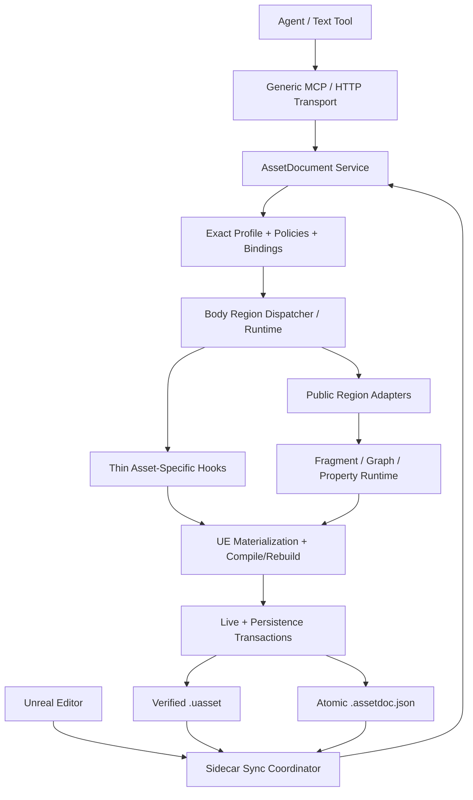

# AssetDocument 架构、设计哲学与扩展原则

## 文档定位

本文是 AssetDocument 的长期架构约束，回答以下问题：

- AssetDocument 要解决什么问题，不解决什么问题；
- `.assetdoc.json`、Unreal asset 和同步状态分别承担什么职责；
- `Properties`、`Body`、`Definitions`、profile、region 和 adapter 如何分工；
- 新增资产类型、region、fragment、graph 或公共能力时应如何决策；
- 怎样判断一个实现是正确扩展，而不是把资产特例继续堆进框架。

本文只定义 AssetDocument。它不是单个资产类型的功能 spec、实现计划、测试报告或阶段 benchmark，也不描述待删除的旧系统。现存代码中为接入旧宿主而保留的桥接依赖属于过渡状态，不构成新设计的先例；AssetDocument 的目标架构必须能够独立承载领域逻辑，任何新工作都不得增加对待删除旧系统的依赖。

本文中的“必须”“不得”是架构约束。单个资产类型的 spec 可以补充更严格的领域规则，但若要改变这里的长期不变量，应先更新本文并说明迁移影响。

## 1. 北极星

AssetDocument 是 Unreal Editor 资产的结构化文本 authoring layer：它让 agent 和工具能够用稳定、可审查、可 diff 的文档表达 UE 资产的作者语义，并通过 Unreal 内部能力完成验证、物化、保存、重载和反向提取。

它的核心目标不是“把 JSON 写进 UObject”，而是维持同一份 **managed semantic state** 在两个可编辑视图中的一致性：

- `.assetdoc.json` 是 agent、版本控制和文本工具面向的 authoring view；
- `.uasset` 是 Unreal Editor、引擎工具和人工编辑面向的 materialized view；
- per-region sync state 记录两边最后一次一致状态，用于判断同步方向和冲突。

因此，AssetDocument 允许两边都被编辑，但不把它们视为两份互不约束、同等独立的真源。对每个 managed region，系统维护一份可 canonicalize、可比较、可冲突检测的作者语义；sidecar 和 UE asset 只是这份语义的两个表示。

## 2. 核心设计哲学

### 2.1 作者语义优先于存储细节

AssetDocument 描述作者希望长期维护的语义，而不是 `.uasset` 的字段转储、对象内存快照或序列化格式镜像。

- 稳定、可编辑、会随资产保存的语义应被表达；
- derived、cache、runtime、debug、transient 和 per-user 状态不应成为可写文档字段；
- 引擎能够由作者语义重建的数据，应在 apply 后由标准 UE 流程重建；
- 不能因为某个字段在 UObject 上可反射，就自动认定它属于 authoring surface。

### 2.2 Delta-first，而不是 raw dump 或 patch DSL

Sidecar 保存相对于明确默认值或基线的有效差异。agent 编辑正常的 `Properties`、`Definitions` 和 `Body` 内容，而不是命令式的 add/remove/replace 操作列表。

AssetDocument 也不是完整 `.uasset` 镜像：未被纳入 managed scope 的内容不应为了“完整”而被转储进文档。这里的完整性指 **完整覆盖经确认的 managed authored surface**，而不是覆盖资产内部所有字段。

### 2.3 声明式策略优先，薄领域 hook 兜底

能用 reflection、profile、region policy、通用 adapter、identity rule 和 canonicalizer 表达的能力，应通过声明和组合实现。

只有以下逻辑应留在资产领域 hook 中：

- UE 专用物化 API；
- compile、rebuild、refresh cache 或 post-apply repair；
- 资产领域特有的 semantic identity；
- 无法由公共 region shape 安全表达的跨 region 约束。

Hook 是受控逃生口，不是每个资产复制一套生命周期的理由。

### 2.4 组合优先于继承

新资产能力应由 exact profile、region binding、region policy、公共 adapter 和薄 hook 组合而成。不得通过不断加深 capability 基类层级来共享行为。

如果公共抽象需要知道完整资产类型、全部 `Body` 结构或大量具体字段名才能工作，它通常已经越过公共层边界。

### 2.5 失败关闭，证据优先

无法证明输入合法、身份稳定、回滚可靠或持久化成功时，AssetDocument 应拒绝操作并返回精确 diagnostic，不得猜测、静默跳过或部分成功后宣称完成。

## 3. 范围与非目标

AssetDocument 负责：

- 文档 schema、模板、profile inspection；
- 动态 class/asset resolution；
- reflected property delta；
- 结构化 managed regions；
- fragment 和 document-local definitions；
- validate、preflight、apply、extract、diff；
- canonicalization、identity、sync direction 和 conflict detection；
- live apply rollback、资产持久化、sidecar 原子写入和落盘后验证；
- 通用 HTTP/MCP authoring surface。

AssetDocument 不负责：

- 镜像所有 UObject 字段或 UE package bytes；
- 让 agent 直接编辑 derived/cache/runtime 数据；
- 把被引用资产的内部作者数据嵌入当前资产文档；
- 用一个全能 adapter 猜测所有资产类型；
- 为每个资产类型增加专用 MCP tool；
- 把 transport 层变成第二套 UE 反射、验证或 coercion 实现；
- 把核心领域行为绑定到某个不可替换的 transport 或宿主实现。

## 4. 规范文档模型

标准文档形态为：

```json
{
  "SchemaVersion": 1,
  "Target": "/Game/Data/DA_Example",
  "Class": "/Script/Example.ExampleAsset",
  "Action": "CreateOrUpdate",
  "Definitions": {},
  "Properties": {},
  "Body": {}
}
```

各顶层字段职责如下：

| 字段 | 职责 |
| --- | --- |
| `SchemaVersion` | 文档合同版本；升级必须有明确兼容或迁移策略 |
| `Target` | 资产 package/object 的稳定目标路径 |
| `Class` | 动态解析的目标 UE class；创建时必需，更新时按合同校验 |
| `Action` | 生命周期意图，如 `Create`、`Update`、`CreateOrUpdate`；不是 patch operation DSL |
| `Definitions` | 文档局部、由作者命名的可复用 fragment |
| `Properties` | 不归结构化 region 所有的 reflected property delta |
| `Body` | exact profile 声明的结构化 managed authored regions |
| `_meta.sync` | 可选、由系统维护的 per-region 同步状态；不是资产作者语义，初始 template 可以省略 |

规范输出不使用资产类型枚举驱动分发。目标 class 和 exact profile 决定结构化能力；没有 exact profile 的 class 只能使用通用 reflected-property 行为。

### 4.1 命名

- `Body` key 优先采用稳定的 UE 字段名或结构名；
- 不为缩短 JSON 引入含义相同的别名或缩写；
- 若 UE 原字段不是安全 source-of-truth，允许使用语义名，但 profile schema 必须解释它物化到什么 UE 行为；
- diagnostic path 使用稳定 JSON Pointer，不能暴露瞬态对象地址或不稳定数组位置作为身份。

### 4.2 缺失语义

对持久 sidecar 中的 managed region，缺失字段通常表示“没有相对于默认/基线的持久差异”，不是“保留当前 `.uasset` 值”。sidecar-to-asset 时应先恢复该 region 的基线语义，再应用文档声明的 delta。

这条规则只影响该文档明确拥有的 managed surface：

- unmanaged 数据必须保留；
- referenced-asset-owned 数据必须留在被引用资产自己的文档中；
- profile 若提供受限 sparse overlay，必须把适用 action、保留规则、重新验证要求和禁止的 create 路径写成显式合同，不能靠“字段恰好缺失”推断。

## 5. 数据所有权分类

扩展任何资产类型前，必须先完成 surface inventory，并把候选数据归入以下类别：

| 类别 | 处理方式 |
| --- | --- |
| Managed authored semantic state | 由 `Body.*` region 或明确的 `Properties` 项拥有，完成完整生命周期 |
| Reflected property delta | 用公共 property runtime 表达；默认与 CDO/父级基线比较 |
| Editor-authored layout/organization | 若稳定持久化且影响作者维护或执行语义，属于 managed authored state |
| Referenced-asset-owned state | 只保存引用；内部内容由被引用资产自己的 AssetDocument 管理 |
| Derived/cache/runtime/debug state | 不可 author；必要时只作为 evidence 或 diagnostic |
| Transient/per-user editor state | 排除，不进入 sidecar |
| Deprecated/migration-only state | 默认排除；兼容任务必须单独说明 |
| Unknown/risky state | 先研究并形成 blocker；不得用 silent ignore 假装支持 |

### 5.1 单一 authoring owner

同一 UE surface 在一个文档合同中只能有一个可写入口。

- 被 `Body` region 的 `ManagedUePropertyPaths` 拥有的属性，不得再次从 `Properties` 写入；
- profile validation 应对重复所有权返回明确错误；
- graph/tree/timeline 的领域对象不能同时由结构化 `Body` 和 raw reflected dump 管理；
- derived representation 不得与其 authored source 同时成为可写真源。

这条规则防止 apply 顺序、diff 结果和双向同步出现互相覆盖。

## 6. 双向同步与冲突模型

每个 managed region 独立维护 canonical sidecar hash 和 canonical asset-evidence hash。同步状态至少能够区分：

| 状态 | 含义 | 默认动作 |
| --- | --- | --- |
| No change | 两边都与 last sync 一致 | 不操作 |
| Sidecar changed | 仅 sidecar 变化 | sidecar → asset |
| Asset changed | 仅 UE asset 变化 | asset → sidecar |
| Both changed | 两边都偏离 last sync | 报告 region conflict，禁止自动猜测 |
| Initial/untracked | 没有可信 last sync | 按明确初始化策略建立 baseline |

冲突粒度应尽量停留在 region，而不是整份资产。两个独立 region 分别在 sidecar 和 Editor 中变化时，只要 ownership 与 sync state 独立，就不应制造无关冲突。

`_meta.sync` 存储同步证据，不存入 `.uasset`，也不参与作者语义 diff。只有当两边都稳定并验证成功后，才能推进 last-sync state；失败必须保留旧状态，供重试或再次报告同一冲突。

默认不实现隐式 element-level merge。复杂 array、tree、graph、timeline region 可以按 region 重建；stable identity 仍必须存在，用于 canonical output、diagnostic path、diff 和未来更细粒度合并。

## 7. 架构分层



### 7.1 Service

Service 是稳定用例入口，负责组织：

- schema、profile 和 template 查询；
- validate、preflight、apply、extract、diff；
- lifecycle、transaction、save、sidecar 和 verification；
- 统一 result 与 diagnostics。

Service 不应包含按资产类型增长的大型 switch。资产差异通过 registry、profile、policy、binding、adapter 和 hook 注入。

### 7.2 Exact profile

Profile 定义某个 exact UE asset class 的文档合同：

- `DocumentShape` 和 template；
- 合法/必需的 `Body` keys；
- region policies 与 bindings；
- body adapter resolution；
- profile 级跨 region 约束。

Exact-class lookup 是安全边界：不得因为 C++ 继承关系就隐式把父 profile 的 authoring contract 套到派生资产。需要复用时，应显式注册兼容 profile 或声明复用关系；否则派生 class 只获得经验证的通用 reflected behavior。

Profile 的职责是装配，不是重新实现每个 region 的 validate/apply/extract/diff。

当前 `IAssetDocumentCapability` 可以作为 profile 与现有领域实现之间的聚合/兼容 seam，但不应继续演化成“每个资产一个巨型 capability”。新逻辑仍应下沉到 region runtime、公共 adapter、fragment/property runtime 或窄领域 hook，使 capability 只负责装配和必要的跨 region 协调。

### 7.3 Region policy 与 binding

每个 managed region 必须有稳定 `RegionId` 和明确 policy。Policy 至少定义：

- `BodyPath` 与 region shape；
- 默认值/基线来源；
- reducer 和 apply mode；
- identity、order、comparison 与 canonicalization 规则；
- `ManagedUePropertyPaths`；
- extract-only 字段和 explicit delete/empty 语义；
- 必要的 extension/canonicalizer hook。

Binding 负责把 `BodyKey`、`RegionId`、adapter、apply order 和 requiredness 连接起来。Dispatcher 统一完成 unknown/required key 检查、稳定顺序、path 构造、region dispatch、跨 region validation 和 post-apply repair 调度。

### 7.4 Public region adapter

公共 adapter 封装可跨 profile 复用的 **shape lifecycle**，例如 object、identity array、fragment array、graph wrapper、tree、timeline placement 或 editor layout。

它应只依赖 region context、policy、JSON、公共 fragment/property runtime 和注入的 hooks。不得：

- 按 asset class、body key 或字段名做全局大 switch；
- 直接理解某个资产的完整 body contract；
- 把 UE 领域 compile/rebuild 逻辑硬编码进通用 JSON utility；
- 复制 dispatcher 已有的校验、diagnostic 或 diff scaffolding。

当第二个 profile 开始复制同一种 validate/preflight/apply/extract/diff 生命周期时，必须评估抽取公共 adapter；是否抽取由语义和 shape 是否真正相同决定，不能只看代码长得相似。

### 7.5 Asset-specific hook

薄 hook 只处理无法公共化的领域转换：

- 从 JSON/fragment 解析成具体 UE 结构；
- 使用 editor subsystem 或 schema API 创建/重建对象；
- 编译、刷新 cache、修复引用；
- 提供领域 identity/comparison/canonicalizer；
- 执行必须看到多个 sibling regions 的领域校验。

Hook 不得拥有第二套文档 lifecycle。

### 7.6 Helper 所有权

Helper 的可见性必须由语义所有权决定，而不是由符号碰撞决定：

- 只被单个 `.cpp` 使用且没有稳定复用语义的 helper，可以放在 file-local/anonymous namespace；
- 两个以上 adapter/profile 共享的 helper，应进入职责明确的公共或模块私有 utility，并使用能表达领域的类型名和 namespace；
- 遇到名字碰撞时，应通过明确命名、namespace 和 owner module 解决，不能为了绕过碰撞把本应复用的 helper 藏进 local namespace；
- 不能复制一份 file-local helper 来规避依赖或链接问题。

## 8. `Properties`、`Body` 与 `Definitions`

### 8.1 `Properties`

`Properties` 用于普通、独立、反射可写且默认 delta 足以表达的资产属性。公共 property runtime 负责类型验证、coercion、对象/类引用、struct/container 等可支持类型以及稳定 diagnostic。

一旦某属性需要结构化 identity、跨字段约束、重建、compile/repair 或专用 omission 语义，就应由 `Body` region 管理，而不是不断给通用 property setter 加资产特例。

### 8.2 `Body`

`Body` 是 profile-owned structured authoring surface。每个 key 必须映射到一个明确 ownership boundary，并完成：

- schema/template exposure；
- validate 与 staging preflight；
- apply 与 rollback；
- extract 与 canonical output；
- semantic diff；
- save、reload 和适用的双向同步。

未知 key、extract-only key 和不支持的 authored 值必须拒绝或产生明确 diagnostic，不能静默丢弃。

### 8.3 `Definitions` 与 fragments

`Definitions` 提供 document-local、稳定、由作者命名的复用单元。引用通过 `DefinitionRef`，不依赖 UObject address、自动生成索引或跨文档隐式全局表。

通用 fragment kinds 可以表达资产引用、类引用、struct value、资产拥有的 embedded object 以及 definition reference。新增 fragment kind 的门槛是：

- 至少有稳定、跨 region 可复用的作者语义；
- 可以独立 validate、compile、extract 和 canonicalize；
- ownership 明确，不会把 referenced asset 的内部内容复制进当前文档；
- 不是为了给单个字段换一个更短的 JSON 写法。

## 9. Graph、Tree、Timeline 与 Editor-authored state

复杂结构的共同原则是“稳定 identity + 显式 topology/order + 领域物化”。

- graph node、tree node、track、section、placement 等必须使用稳定 semantic identity；
- 数组 index 只有在经 UE 语义证明稳定且不可重排时才能作为 identity；
- 连接、父子关系、执行顺序和语义顺序必须显式表达；
- 如果 layout 会持久保存并影响阅读、维护或执行语义，它属于 authored state；
- derived runtime graph/tree/cache 由 UE 标准 rebuild 产生，不成为第二份可写真源；
- 不支持的 node/class/field 必须给出稳定 code、path、class 和 suggested action，不能 silent ignore。

GraphSpec、tree spec 或 timeline spec 应保持领域中立的公共结构；具体 UE node class、pin/member 解析、树重建或时间轴 repair 通过窄 adapter/hook 扩展。

## 10. Canonicalization、identity 与 diff

Canonicalization 的目标是消除表示噪声，同时保留作者语义。

必须区分：

1. **hash canonicalization**：用于 sync direction、conflict detection 和 semantic equality；
2. **sidecar writeback canonicalization**：用于产生稳定、可读、低 churn 的文本。

两者可以共享规则，但不能假设输出目的完全相同。Canonicalizer 还必须知道输入是 sidecar-authored value 还是 asset evidence，避免把合法作者意图误当成提取噪声删除。

规则：

- JSON object key 顺序通常不具语义，可以规范化；
- array、graph child、track 或 key 顺序是否有语义由 region policy 决定；
- omitted default、explicit empty 和 explicit delete 必须按 policy 区分；
- float tolerance、case、path、enum 和引用规范化必须由稳定合同决定；
- graph/资产特有等价关系不得塞进全局 canonical JSON utility；
- diff path 使用 stable identity token，并进行统一 JSON Pointer escaping。

Semantic diff 比较 desired authored state 与 canonical asset evidence，不比较 raw JSON formatting、UObject memory 或 package bytes。

## 11. Apply、事务与持久化

一次成功 apply 必须是完整事务，不是“某个 setter 返回成功”。

### 11.1 阶段

1. 解析文档和 class/target；
2. 完成 schema、ownership、reference 和跨 region validation；
3. 在 transient/staging 环境完成 preflight，证明整份文档可物化；
4. 对 live asset 建立足以恢复的 snapshot/transaction；
5. 按稳定顺序 apply regions，并执行 compile/rebuild/repair；
6. canonical extract/diff 验证 live semantic state；
7. 在临时路径持久化 package，fresh-load 并再次验证；
8. 原子安装 package，并原子写入 sidecar；
9. 验证最终 bytes、registry/identity、sidecar metadata 和 semantic state；
10. 只有全部成功后更新 sync state 并返回 success。

### 11.2 失败不变量

- 新资产失败后不得残留 package、sidecar、asset registry ghost 或游离 owned UObject；
- 已有资产失败后必须恢复内存状态、对象身份、引用、dirty state 和原有磁盘 bytes；
- sidecar 写入使用同目录临时文件和原子替换；
- 无法为 dirty existing asset 提供可靠 rollback 时必须 fail closed；
- `SavePackage` 成功不是完成证据，fresh reload + canonical verification 才是持久化成功门槛；
- partial result 必须精确说明哪些阶段完成、哪些未完成，不能把已污染状态包装成普通 validation failure。

Service transaction 与 profile transaction 可以分层组合：公共层保存 reflected properties、owned object/package identity 和 durable bytes；profile 仍负责其领域内部 graph/cache/reference 的完整恢复。两层都不能假设另一层会自动覆盖自己的责任。

## 12. Diagnostics 合同

所有外部可见错误至少包含：

- 稳定 `Code`；
- 精确 `Path`；
- 面向人的 `Message`；
- 能帮助修复时附 class、expected/actual、identity 或 suggested action。

禁止用以下方式隐藏不完整能力：

- `_Skipped` 作为可 authored 输入；
- silent ignore；
- 把非空输入当空值接受；
- 只 validate 不 apply，却在 schema 中宣称支持；
- 只支持 fixture 白名单却对外宣称动态 class 支持；
- canonicalization 删除无法处理的 authored 数据；
- 用宽泛 `ValidationFailed` 代替已知、可稳定分类的领域错误。

Extract-only evidence 可以帮助盘点不支持的现有内容，但它不能被 roundtrip 回 `Body`，也不能成为“功能已完整”的证据。

## 13. Transport 与 MCP 边界

AssetDocument 对外暴露一组通用能力：

- schema；
- inspect class/asset；
- inspect profile；
- create template；
- validate；
- diff；
- extract；
- apply / apply-file。

新增资产类型默认不增加专用 MCP tool。MCP/HTTP 层只负责参数合同、转发、超时和结果序列化；以下行为必须由 Unreal/C++ AssetDocument 层拥有：

- UE class/asset resolution；
- reflection 和 property coercion；
- profile/region validation；
- preflight、apply、transaction 和 persistence；
- extract、canonicalization 和 semantic diff。

这样 CLI、MCP、file watcher、Editor sync 和未来宿主共享同一条领域实现，不会出现 transport 间语义漂移。Transport adapter 必须可替换，AssetDocument 的领域逻辑不能依赖具体宿主才能成立。

## 14. 扩展决策流程

### 14.1 新资产类型

按以下顺序执行：

1. 从 UE 源码和真实资产盘点 authored surface；
2. 分类 managed、reflected、referenced-owned、derived/cache、editor layout、transient 和 unknown；
3. 确认哪些只需通用 `Properties`，哪些需要 `Body` regions；
4. 为每个 region 定义 ownership、shape、identity、order、default、omission、comparison、apply 和 repair；
5. 优先匹配现有 public adapter；
6. 只为 UE 领域物化写薄 hook；
7. 若出现可跨 profile 复用的新 shape，再先扩公共 adapter/runtime；
8. 注册 exact profile，补 schema/template/inspection；
9. 完成 validate → preflight → apply → extract → diff → save → reload → sync 的闭环验证；
10. 更新资产 spec、surface inventory、deferred/excluded evidence 和 benchmark。

### 14.2 新 region

新增 region 前必须回答：

- 它拥有哪一段 UE authored surface？
- 为什么不能由 `Properties` 表达？
- 它的默认/基线来自哪里？
- 缺失、`null`、空 object/array 和 explicit delete 分别是什么意思？
- 身份和顺序是否有语义？
- 是否需要跨 region validation？
- apply 后需要什么 compile/rebuild/repair？
- 如何 canonicalize、extract 和构造稳定 diff path？
- 如何 rollback？

答不清 ownership、identity 或 omission 语义时，不应先写 adapter。

### 14.3 新 public adapter

只有满足下列条件才新增：

- 表达的是可复用 region shape/lifecycle，而非一个资产的完整合同；
- 至少有第二个真实使用场景，或当前重复已经明确；
- 资产差异可通过 policy/config/hooks 注入；
- adapter 不需要全局 asset/body switch；
- 有 adapter 层单测，并由 profile 层测试 UE materialization。

如果当前只有一个资产使用且公共 API 会因猜测未来需求而膨胀，先保留窄 hook；第二次出现时重新评估。

### 14.4 修改公共 runtime

公共 runtime 变更必须说明：

- 哪个稳定 authoring contract 无法表达；
- 为什么 profile hook 不能安全解决；
- 对已有 profiles、canonical hashes、sidecar writeback、diagnostics 和 rollback 的兼容影响；
- 是否需要 schema version 或 migration；
- 覆盖公共行为与至少一个真实 profile 的测试。

## 15. 禁止的架构模式

- 为每个资产类型复制完整 capability lifecycle；
- `UniversalRegionAdapter` 或按 asset class/body key 的巨型 switch；
- 用 capability inheritance tree 代替 adapter composition；
- raw `.uasset`/UObject dump 作为 authoring format；
- 同一 UE surface 同时由 `Properties` 和 `Body` 可写；
- 把 referenced asset internals 嵌入当前文档；
- author derived/cache/transient/per-user data；
- 用数组 index、UObject name/address 或临时 graph index 作为稳定 identity；
- 在全局 JSON/canonical utility 中硬编码资产特例；
- 为每个 profile 增加专用 MCP tool；
- 为规避符号碰撞或依赖设计而复制/隐藏本应共享的 helper；
- 用 deferred、empty-only、validate-only、fixture-only、`_Skipped` 或 silent ignore 缩减已确认的 managed authored scope；
- 把临时集成桥接当作 AssetDocument 核心架构的默认接入方式。

## 16. 验证与完成定义

### 16.1 分层验证

| 层级 | 最低证据 |
| --- | --- |
| Utility/fragment/property | focused unit/automation，覆盖合法值、边界值和精确 diagnostics |
| Public adapter/runtime | shape lifecycle、identity、omission、canonical diff、unknown/required key |
| Exact profile | 真实 UE materialization、跨 region 约束、compile/rebuild/repair、rollback |
| Service/persistence | create/update、atomic failure、save、fresh reload、canonical verification |
| Transport | MCP/Python 或 HTTP smoke，证明通用入口没有语义漂移 |
| Real editor workflow | sidecar ↔ asset、Editor edit、冲突、保存、重启/重新加载后的结果 |

### 16.2 “完整”的含义

某个资产类型或 region 只有在其经确认的 managed authored surface 全部完成文档生命周期并有真实持久化证据时，才能标记 complete。

排除项必须有 UE ownership/derived/transient 依据；managed authored deferred 必须有用户批准的 blocker 或仍标记 partial。不能用旧 benchmark、测试数量、成功 merge 或“代码路径存在”替代当前实现证据。

### 16.3 Goal 验收边界

每个开发 Goal 的验收范围由最新用户指令、该 Goal 的 spec/plan 和明确依赖决定。默认验证应包含与变更风险相称的：

- 默认 Unity Build；
- focused automation；
- 被本次变更触及的公共依赖测试；
- MCP/Python smoke；
- 适用时的真实 Editor save/reload/restart；
- `git diff --check` 和文档一致性。

全仓聚合套件不是所有 Goal 的无条件完成门槛。范围外的已知失败必须单独记录和归因，不能自动扩张当前 Goal；同样，focused tests 通过也不能掩盖本 Goal 确实修改到的公共 runtime 回归。

环境、OS、toolchain、共享 Engine 与产品代码故障必须分开归因。证据指向环境层时，应停止把它当作产品回归，并且不得未经授权扩展到范围外功能、共享 Engine 或系统策略。

## 17. 文档与演进治理

AssetDocument 文档分为四层：

1. **本文**：长期架构和扩展不变量；
2. **资产类型 spec / surface inventory**：某个 exact profile 的 authoring contract；
3. **implementation plan**：一次实现的任务顺序、测试和迁移步骤；
4. **benchmark / verification report**：特定 checkpoint 的证据快照。

低层文档不得静默改变高层合同。实现发现长期原则不成立时，应先更新本文；资产 authored surface 变化时，应更新对应 spec/inventory；测试结果和端口、PID、commit SHA 等易过期证据只放 report，不写入本文。

新增 AssetDocument 功能的 review 至少检查：

- ownership 是否唯一；
- profile 是否以组合为主；
- public adapter 是否真的公共；
- hook 是否足够薄；
- identity/order/omission/canonicalization 是否明确；
- transaction 和 rollback 是否覆盖真实 UE 状态；
- diagnostics 是否稳定可执行；
- MCP/HTTP 是否仍只是通用 transport；
- module 和 transport 边界是否仍然可独立替换；
- 文档、schema、实现和验证证据是否一致。

## 18. 当前代码锚点

以下文件是本文原则在当前代码中的主要落点。它们是导航入口，不代表所有实现已经达到本文的目标状态：

- `Source/AssetDocument/Public/AssetDocumentService.h`
- `Source/AssetDocument/Public/AssetDocumentProfile.h`
- `Source/AssetDocument/Public/AssetDocumentPolicy.h`
- `Source/AssetDocument/Public/AssetDocumentRegion.h`
- `Source/AssetDocument/Public/AssetDocumentFragment.h`
- `Source/AssetDocument/Private/AssetDocumentService.cpp`
- `Source/AssetDocument/Private/AssetDocumentBodyRegionDispatcher.cpp`
- `Source/AssetDocument/Private/AssetDocumentRegionRuntime.cpp`
- `Source/AssetDocument/Private/AssetDocumentManagedPropertyPartition.cpp`
- `Source/AssetDocument/Private/AssetDocumentRegionCanonicalizer.cpp`
- `Source/AssetDocument/Private/AssetDocumentApplyTransaction.cpp`
- `Source/AssetDocument/Private/AssetDocumentPersistenceTransaction.cpp`
- `Source/AssetDocument/Private/AssetDocumentAtomicFile.cpp`
- `Source/AssetDocument/Private/AssetDocumentSidecarSyncEngine.cpp`
- `MCP/schemas/AssetDocument.md`

历史 spec、guide、plan 和 report 可以解释某项原则的形成过程或提供实现证据，但本文应保持为不依赖单个资产、分支或 Goal 的稳定入口。
