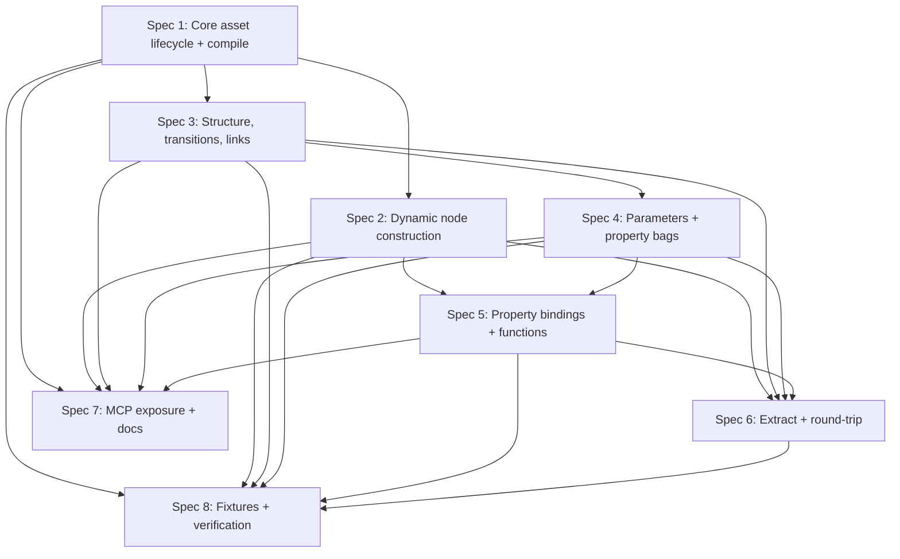

# StateTree Generator 子 Spec 拆分

**日期**：2026-04-27
**状态**：Draft（待用户审阅）
**目标**：把“功能完备的 StateTree generator”拆成若干可独立评审、实现、验证的子 spec。本文不是 implementation plan。

---

## 1. 总目标

新增 `StateTree` asset generator，使 UECopilot 能通过 JSON 创建、更新、提取 UE 5.7 `UStateTree` 资产，并覆盖实际项目需要的完整编辑器语义：

- schema-aware StateTree 创建与编译。
- state / subtree / linked state / linked asset。
- task、evaluator、global task、condition、consideration。
- C++ struct node 与 Blueprint node。
- root/state parameters。
- property bindings 与 property function bindings。
- extract / round-trip。
- MCP schema、fixtures、编译与编辑器验证。

设计边界：generator 构建 `UStateTreeEditorData`，然后调用官方 compiler 生成 runtime baked data；不直接手写 runtime compact arrays。

---

## 2. 推荐子 Spec

### Spec 1：Core Asset Lifecycle + Compile Path

**目标**：让最小合法 `StateTree` asset 能创建、编译、保存、提取基础元信息。

范围：

- 新增 `AssetType: "StateTree"`。
- 动态解析 `SchemaClass`。
- 通过 `UStateTreeFactory` 或等价官方顺序创建 `UStateTreeEditorData`、`Schema`、`EditorSchema`、root state。
- 调用 `UStateTreeEditingSubsystem::ValidateStateTree()` / `CompileStateTree()`。
- 处理 compile log 和失败回滚。
- 注册 generator、模块依赖、基础 MCP schema 暴露。

验收：

- 生成只有 root state 的 StateTree。
- 编译成功，保存后重新加载仍已编译。
- `extract_assets` 能输出 asset type、schema、root/subtree skeleton。
- 编译失败不会留下已注册/已保存半成品。

依赖：无。
后续依赖方：所有其他 StateTree 子 spec。

### Spec 2：JSON Contract + Dynamic Node Construction

**目标**：支持通过 JSON 动态创建 editor nodes，不硬编码具体节点类型。

范围：

- 定义统一 `FStateTreeEditorNode` JSON 形态。
- 支持 task、evaluator、global task、condition、consideration。
- 支持 `node.properties`、`instance.properties`、`executionRuntimeData.properties`。
- 动态解析 `UScriptStruct` / `UClass`。
- 调用 `GetInstanceDataType()` / `GetExecutionRuntimeDataType()` 初始化 instance。
- 支持 Blueprint node wrapper 的最小路径。
- schema-aware node category validation。

验收：

- 可生成包含 delay/task/condition/evaluator 的基础树。
- 对 unknown node、category mismatch、schema disallowed node 返回明确错误。
- 不新增具体 StateTree 节点类型 switch。
- 编译器不报 missing instance value。

依赖：Spec 1。

### Spec 3：State Tree Structure + Transitions + Linked Assets

**目标**：完整表达 StateTree 的结构语义。

范围：

- `SubTrees` 同时表达 root 和 `Type=Subtree` roots。
- state fields：`id`、`name`、`type`、`selectionBehavior`、`tasksCompletion`、`tag`、`description`、`enabled`、`customTickRate`。
- children 与 canonical path。
- transitions：trigger、priority、delay、required event、target、conditions、enabled。
- linked state、linked subtree、linked asset。
- 两阶段引用解析：先建 state，再 resolve links/transitions。
- stable ID/GUID 策略。

验收：

- 支持 `GotoState`、`NextState`、`NextSelectableState`、`Succeeded`、`Failed`。
- linked subtree 和 linked asset 能编译。
- target 歧义、缺失、不可选择状态会在 ValidateConfig 阶段报错。
- Extract 输出 stable id + readable path，不输出 runtime compact handles。

依赖：Spec 1、Spec 2。

### Spec 4：Parameters + Property Bags

**目标**：支持 root parameters 和 state parameters 的可编辑 schema 与默认值。

范围：

- `RootParameterPropertyBag`。
- `UStateTreeState.Parameters`。
- property bag 类型契约：primitive、enum、struct、object/class/soft refs、array、nested struct 的取舍。
- property ID / GUID 保留策略。
- state parameter overrides。
- linked state / linked asset 参数同步。

验收：

- 生成 root/state parameters 后，编辑器可见且编译后 runtime parameters 正确。
- Extract 能 round-trip parameter schema 和默认值。
- 修改参数不破坏已有 binding 引用。

依赖：Spec 1、Spec 3。

### Spec 5：Property Bindings + Property Function Bindings

**目标**：覆盖 StateTree 最复杂但最关键的连接语义。

范围：

- `FStateTreeEditorPropertyBindings`。
- `FPropertyBindingPath` source/target path。
- struct/node/state reference 到 GUID 的解析。
- property bag property ID。
- binding validation。
- property function binding。
- extract / round-trip binding。

验收：

- node instance property 可绑定到 parameter/context/evaluator output。
- binding source/target 路径错误有可读诊断。
- `Extract -> Generate -> Extract` 后 binding 稳定。
- property function binding 至少覆盖一个真实可验证 fixture。

依赖：Spec 2、Spec 4。

### Spec 6：Extract + Round-trip

**目标**：让 generator 不只是写资产，也能可靠读取现有 StateTree。

范围：

- `CanExtract` / `Extract`。
- `diffOnly` 策略。
- editor data 到 JSON 的序列化。
- C++ struct node、Blueprint node、parameters、bindings、transitions 的输出。
- 不输出 runtime compact handles。
- 处理缺失或未编译资产。

验收：

- `Generate -> Extract` 得到可重新生成的 JSON。
- `Extract -> Generate -> Extract` 在稳定字段上相等。
- 支持 invalid/partial asset 的可诊断错误。

依赖：Spec 2、Spec 3、Spec 4；完整绑定 round-trip 依赖 Spec 5。

### Spec 7：MCP Exposure + Documentation

**目标**：保证 Codex/LLM 工具层知道如何使用 StateTree generator。

范围：

- 新增 `MCP/schemas/StateTree.md`。
- 更新 `MCP/src/index.ts` 中 asset type enum、fallback 文案、`generate_assets` description。
- 如项目惯例要求，更新 `MCP/dist`。
- 添加 MCP schema 层测试，防止 generator 已注册但工具 schema 不暴露。
- 明确是否顺手补 `BehaviorTree` / `BlackboardData` schema 暴露缺口。

验收：

- `get_generator_schema(StateTree)` 可用。
- `generate_assets` tool schema 允许 `AssetType: "StateTree"`。
- 文档包含最小、节点、transition、parameters、bindings 示例。

依赖：Spec 1 起步即可；完整文档随 Spec 2-5 迭代。

### Spec 8：Fixtures + Editor/MCP Verification

**目标**：建立长期回归保护。

范围：

- `TestData/ST_TestSample.json`
- `ST_TestSample_parameters.json`
- `ST_TestSample_bindings.json`
- `ST_TestSample_linked_subtree.json`
- `ST_TestSample_linked_asset.json`
- invalid fixtures：unknown node、schema disallowed node、bad transition target、bad binding path。
- UBT Development 编译。
- 编辑器启动 + MCP `health_check`。
- `generate_assets` / `extract_assets` / `execute_python` 验证。
- 必要时截图或 editor data 检查。

验收：

- 每个子 spec 都有至少一个 positive fixture 和一个 negative fixture。
- 生成资产能通过 compile/link。
- invalid fixture 返回稳定错误，不 crash。

依赖：可随 Spec 1-7 持续补齐。

---

## 3. 推荐执行顺序

推荐先做 Spec 1 + Spec 7 的最小闭环，确保工具层能看到 `StateTree`，再推进 Spec 2/3 的语义能力。Spec 4/5 是功能完备的核心难点，应独立评审，避免基础 generator 被 binding 复杂度拖住。

---

## 4. 功能完备的定义

这里的“功能完备”不是首个实现就一次完成，而是最终达到以下能力：

- 能创建合法 `UStateTree` 资产，并走官方 compile path。
- 能表达编辑器里常用的 StateTree 结构与节点。
- 能表达 schema、context、parameters、bindings。
- 能处理 linked subtree 和 linked asset。
- 能支持 C++ 与 Blueprint 节点。
- 能 extract 和 round-trip，不丢 stable identity。
- 能通过 MCP 工具被 LLM 正确发现和使用。
- 有 positive/negative fixtures 和编辑器自动化验证。

---

## 5. 当前建议的下一步

下一步不直接实现。建议先让用户确认本拆分，然后为 Spec 1 写正式设计文档：

- `docs/superpowers/specs/YYYY-MM-DD-statetree-generator-core-lifecycle-design.md`
- `docs/superpowers/plans/YYYY-MM-DD-statetree-generator-core-lifecycle-implementation.md`

Spec 1 通过后，再按依赖逐步写 Spec 2、Spec 3。Property bag / binding 相关 spec 可以提前 research，但不建议塞进第一个实现计划。
