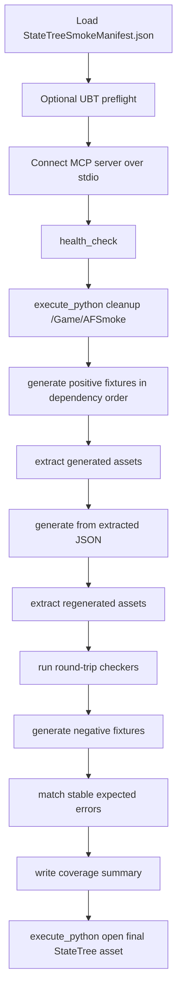

# StateTree Generator Final Verification Design

**日期**：2026-04-29
**状态**：已批准进入计划阶段
**范围**：StateTree generator Spec 8，fixtures + Editor/MCP verification final pass
**依赖**：StateTree Spec 1-7 已完成并合入 AssetFactory `master`

---

## 1. 背景

StateTree generator 已经按子 spec 完成 core lifecycle、dynamic node construction、structure/transitions、parameters/property bags、property bindings、extract/round-trip，以及 MCP exposure/docs。每个阶段都做过单点 smoke，但最终交付还缺一个长期可复跑的封口入口：一条命令清理并重建代表性 StateTree assets，验证 positive/negative fixtures、extract/round-trip 稳定性、MCP health、Editor 可打开性，并把最终成果保留在 Editor 里给人工验收。

Spec 8 的目标不是继续扩展 StateTree generator 的功能面，而是把已经交付的功能收束成稳定验收套件，同时修掉会影响最终验收可信度的低风险 polish。任何会变成新功能、需要额外设计、或当前无法可靠实现的项，都必须及时记录到项目级 `AGENTS.md`，说明原因、影响和后续建议，不能只口头略过。

---

## 2. 目标

- 建立一个最终 smoke runner，默认执行 MCP/Editor 验收，不做 `BuildPlugin` 或打包。
- runner 每次先清理 `/Game/AFSmoke`，再重建本次验收资产；跑完后保留本次成果，最后打开最终验收 StateTree asset。
- 引入 fixture manifest，明确每个 fixture 覆盖哪个子 spec、是否 positive/negative、依赖关系、期望错误关键字和是否参与 round-trip。
- 覆盖 StateTree Spec 1-7 的代表 fixture，并验证 invalid fixture 稳定失败且不 crash。
- 把正常 UBT 编译作为可选 preflight，而不是默认每次 smoke 都跑。
- 纳入影响最终验收稳定性的 deferred polish：binding extraction 输出排序、GUID node id round-trip fixture、coverage report。

---

## 3. 非目标

- 不新增 StateTree runtime 语义或新节点类型支持。
- 不实现 editor-authored `instanceStruct` / `access` generation round-trip；如果验证中确认仍不可支持，记录到 `AGENTS.md`。
- 不实现 multi-segment property function input graph 的完整 DSL；如果保留限制，记录到 `AGENTS.md`。
- 不把 `RunUAT BuildPlugin` 放入流程；此前已确认它会触发大量 Engine 冷编译，不适合作为本地 smoke 默认路径。
- 不把跑完后的 `/Game/AFSmoke` 自动删除；用户需要在 Editor 中验收成果。

---

## 4. 用户确认的设计决策

### 4.1 最终验收入口

采用“批量自动化 + 最后打开 Editor 让用户肉眼验收”的形态。

默认流程：

1. 检查 MCP/Editor 连接。
2. 清理 `/Game/AFSmoke`。
3. 批量生成 positive fixtures。
4. 执行 extract。
5. 用 extracted JSON 重新生成。
6. 再次 extract。
7. 对每个 round-trip fixture 跑 checker。
8. 批量运行 invalid fixtures，断言稳定失败。
9. 输出 coverage summary。
10. 通过 `execute_python` 打开最终验收 asset。

### 4.2 `/Game/AFSmoke` 策略

每次 smoke 先删除 `/Game/AFSmoke` 下由本套件生成的资产，再重建。跑完后保留本次结果，不自动清理。这样可以避免旧资产污染验证，同时让用户可以直接在 Editor 里验收。

### 4.3 UBT 编译策略

正常 UBT 编译作为可选 preflight，例如通过 `--preflight-build` 或 `STATETREE_SMOKE_PREFLIGHT_BUILD=1` 启用。

默认 smoke 不触发 UBT，因为迭代时更需要快速验证 MCP/Editor 行为。最终交付报告中需要明确是否跑过 preflight。

### 4.4 Deferred polish 策略

本 spec 纳入稳定性必需项：

- extraction 输出排序，避免 round-trip JSON 因非确定性顺序漂移。
- GUID node id pass-through fixture，锁定 extract 后再次 generate 的 node id 兼容性。
- manifest coverage 表，防止后续新增 fixture 没有被 smoke 覆盖。

以下项只在低风险且不扩大设计面时处理；否则必须记录到项目级 `AGENTS.md`：

- `RegisterStateReference()` duplicate state GUID validation transactionality。
- editor-authored `instanceStruct` / `access` generation 表达。
- multi-segment function input target paths。
- unsupported/cyclic property function input graph 的 extraction diagnostics。

---

## 5. 组件设计

### 5.1 Fixture manifest

新增一个机器可读 manifest，建议路径：

```text
TestData/StateTreeSmokeManifest.json
```

Manifest item 字段：

| 字段 | 类型 | 说明 |
| --- | --- | --- |
| `name` | string | fixture basename，不含 `.json` |
| `kind` | `"positive"` / `"negative"` | 是否应生成成功 |
| `spec` | string | 覆盖子 spec，如 `core`、`dynamic`、`structure`、`parameters`、`bindings`、`roundtrip` |
| `description` | string | 覆盖意图 |
| `dependsOn` | string[] | 生成前置 fixture，例如 linked asset target |
| `roundTrip` | boolean | 是否参与 extract/regenerate/extract checker |
| `expectedError` | string | negative fixture 期望错误片段 |
| `openOnSuccess` | boolean | 是否作为最终 Editor 打开资产 |

Manifest 是 runner 的唯一 fixture 列表来源，避免脚本里长期维护多份 hard-coded arrays。

### 5.2 Final smoke runner

升级现有：

```text
MCP/scripts/statetree_roundtrip_mcp_smoke.mjs
```

保留现有 MCP client + `generate_assets` / `extract_assets` / `execute_python` 路径，避免引入第二套协议。主要变化：

- 从 manifest 读取 fixtures。
- 按 `dependsOn` 做简单拓扑排序，确保 linked target 先生成。
- 在生成前通过 `execute_python` 清理 `/Game/AFSmoke`。
- 为 positive / negative / round-trip / coverage 输出结构化 summary JSON。
- 支持可选 UBT preflight 参数或环境变量。
- 最后打开 manifest 中 `openOnSuccess: true` 的 asset；默认打开综合 round-trip fixture。

建议输出目录保持可配置：

```text
STATETREE_ROUNDTRIP_OUT=/tmp/assetfactory-statetree-roundtrip
```

新增或更新 npm script：

```json
"smoke:statetree-final": "node scripts/statetree_roundtrip_mcp_smoke.mjs"
```

旧的 `smoke:statetree-roundtrip` 可以保留为 alias，避免破坏已有习惯。

### 5.3 Cleanup Python

runner 通过 `execute_python` 调用 Editor 侧清理逻辑：

- 删除 `/Game/AFSmoke` 下本套件生成的 assets。
- 保存/刷新 Asset Registry。
- 如果目录不存在，视为成功。
- 不清理用户其他路径。

清理失败必须 fail fast，避免后续结果混入旧资产。

### 5.4 Round-trip checker

继续使用：

```text
docs/superpowers/verification/statetree_roundtrip_check.py
docs/superpowers/verification/statetree_binding_roundtrip_check.py
```

必要时扩展 checker 的 normalization，但不能通过忽略真实字段来掩盖 generator 回归。新增 normalization 前需要在设计/计划中说明为什么该字段是 editor noise，而不是 generator 输出契约。

### 5.5 Coverage report

runner 输出 coverage summary：

- positive fixture 数量。
- negative fixture 数量。
- round-trip fixture 数量。
- 每个 spec 的 covered fixture 列表。
- expected error 匹配结果。
- 最终打开的 asset path。

输出既要在 stdout 可读，也要写入 JSON 文件，例如：

```text
/tmp/assetfactory-statetree-roundtrip/summary.json
```

---

## 6. 数据流



---

## 7. Error Handling

- MCP `health_check` 不为 `ok`：立即失败，提示 Editor/MCP server 未就绪。
- `/Game/AFSmoke` 清理失败：立即失败，不继续生成。
- Positive fixture 生成失败：记录 fixture name、spec、message，立即失败。
- Extract 缺少 expected asset：立即失败。
- Round-trip mismatch：输出 checker diff 文件路径，立即失败。
- Negative fixture 成功生成：立即失败，因为 invalid contract 失效。
- Negative fixture 失败但错误不匹配：立即失败，要求更新 fixture 或 expected error。
- Editor open final asset 失败：smoke 失败，因为用户无法验收成果。

---

## 8. 验收标准

设计完成后，implementation 必须至少证明：

- `npm --prefix MCP test` 通过。
- `npm --prefix MCP run smoke:statetree-final` 在已有 Editor/MCP server 上通过。
- smoke 输出显示：
  - `HEALTH success=true`
  - positive generated count 等于 manifest positive 数量
  - round-trip checked count 等于 manifest `roundTrip: true` 数量
  - negative failed count 等于 manifest negative 数量
  - final opened asset path 是 `/Game/AFSmoke/ST_RoundTrip_Comprehensive`
- `/tmp/assetfactory-statetree-roundtrip/summary.json` 存在，并包含 spec coverage。
- 最后 Editor 中打开最终验收 StateTree asset，供用户截图/肉眼确认。
- 如果启用 preflight，正常 Mac UBT 编译命令成功；如果未启用，最终报告明确说明未跑 preflight。

---

## 9. Worktree 和提交策略

- 使用独立 AssetFactory worktree：

```text
/Volumes/Mac/GameDev/ProjectRPG/.worktrees/AssetFactory-statetree-final-verification
```

- 分支：

```text
feature/statetree-final-verification
```

- 每个实现 task 小步提交。
- 完成后合回 AssetFactory `master` 并 push，再更新 ProjectRPG 的 `Plugins/AssetFactory` submodule 指针。

---

## 10. AGENTS.md 记录协议

本 spec 明确采用用户要求：

> 后续如果有不能做、暂不该做、或风险超出本 spec 的事项，必须及时记录到项目级 `AGENTS.md`。

记录位置：

```text
/Volumes/Mac/GameDev/ProjectRPG/AGENTS.md
```

记录内容至少包括：

- 事项名称。
- 为什么当前不能做或不该做。
- 对 StateTree generator 最终交付的影响。
- 后续建议的处理方式。
- 日期和对应 spec 名称。

如果只是普通 reviewer minor 且不影响最终交付，可以继续写入 `docs/superpowers/notes/*deferred-polish.md`；但只要属于“不能做/暂不做”的能力或设计缺口，就必须同步到 `AGENTS.md`。

---

## 11. 风险

- Editor/MCP smoke 依赖已经打开并加载 AssetFactory 的真实 Editor，runner 需要给出清晰的 failure message。
- `/Game/AFSmoke` 清理逻辑必须只碰 smoke 目录，不能扩大到用户内容。
- expected error 过度精确会导致 UE 文案小变动引发脆弱失败；过度宽松又会漏掉真实回归。manifest 应记录稳定关键词，而不是整段错误全文。
- 如果 preflight build 被开启，它可能消耗较长时间；默认关闭可以保持迭代效率。

---

## 12. 下一步

进入 implementation plan：

1. 写 manifest 和 coverage tests。
2. 升级 runner 使用 manifest、cleanup、summary 和 final open。
3. 补必要 polish fixtures/checker。
4. 跑 MCP tests 和真实 Editor/MCP smoke。
5. reviewer 审查后合并推送。
