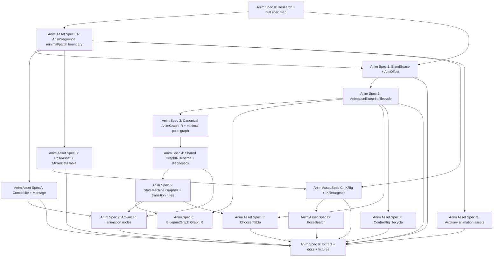

# Animation Generators 规格映射

**日期：** 2026-04-30
**状态：** 供用户审阅的草稿
**分支：** `feature/animation-generators-specs`
**目标：** 将 Animation Blueprint 及相关动画资产生成器工作拆分成小规格，使其可以独立研究、实现、审查和验证。

---

## 1. 总体目标

向 AssetFactory 添加一组动画生成器，使 agents 能够创建、更新、提取和验证 Unreal Engine 动画创作资产：

- `BlendSpace`、`BlendSpace1D`、`AimOffset` 和 `AimOffset1D` 资产。
- `AnimComposite`、`AnimMontage`、`PoseAsset` 和 `MirrorDataTable` 等动画组合/镜像/姿势资产。
- 通过官方 AnimBlueprint factory 和 compiler 路径创建的 `AnimationBlueprint` 资产。
- Animation Blueprint 姿势图。
- 动画状态机和过渡规则。
- 通过 `Body.Graphs.BlueprintGraphs` 集成的普通 Blueprint/EventGraph/function 逻辑。
- `IKRig`、`IKRetargeter`、`PoseSearchSchema`、`PoseSearchDatabase`、`ChooserTable` 和 `ControlRigBlueprint` lifecycle 等后续动画工作流资产。
- `AnimSequence` 的受限 minimal/patch 能力，以及对 `Skeleton`、`SkeletalMesh` 这类 import-heavy 资产的引用/验证边界。
- MCP schemas、fixtures、提取和 round-trip 检查。

设计保留 AssetFactory/AssetDocument 的顶层 JSON。2026-06-12 后，Animation graph 创作不再委托给专用源码块；长期方向改为 Agent-facing typed JSON GraphIR。AnimGraph、StateMachine 和 Blueprint/EventGraph 仍然分成不同 profile section，但它们都应通过 `Body.Graphs` 下的 canonical JSON 表达，而不是 `AnimGraphDSL`、`AnimStateMachineDSL` 或 `BSLFragment`。

---

## 2. 契约层

### 顶层 JSON

顶层 JSON 仍然是稳定的 AssetFactory 入口点：

```json
{
  "AssetType": "AnimationBlueprint",
  "Name": "ABP_Enemy",
  "Path": "/Game/Anim",
  "ParentClass": "AnimInstance",
  "Skeleton": "/Game/Characters/SK_Enemy_Skeleton.SK_Enemy_Skeleton",
  "PreviewMesh": "/Game/Characters/SK_Enemy.SK_Enemy",
  "Variables": [
    { "Name": "Speed", "Type": "Float", "DefaultValue": "0.0" },
    { "Name": "bIsInAir", "Type": "Bool", "DefaultValue": "false" }
  ],
  "DefaultProperties": {},
  "Body": {
    "Graphs": {
      "AnimGraph": {
        "Nodes": {
          "Locomotion": {
            "Kind": "StateMachineRef",
            "StateMachine": "Locomotion"
          }
        },
        "Outputs": {
          "Pose": {
            "From": { "Node": "Locomotion", "Pin": "Pose" }
          }
        }
      },
      "StateMachines": {
        "Locomotion": {
          "Entry": "Idle",
          "States": {
            "Idle": {
              "Pose": {
                "Kind": "SequencePlayer",
                "Animation": "/Game/Anim/Idle.Idle"
              }
            }
          },
          "Transitions": []
        }
      },
      "BlueprintGraphs": {
        "EventGraph": {
          "Nodes": {},
          "Edges": []
        }
      }
    }
  }
}
```

顶层 variables 使用现有 `BlueprintGenerator` 形状：`Name`、`Type` 和可选字符串 `DefaultValue`。生成流程应接受 `Bool` 和 `Boolean` 作为 Blueprint bool 变量的别名，因为提取结果可能使用面向引擎的拼写。

### AnimGraph GraphIR

`Body.Graphs.AnimGraph` 表达姿势图结构。它负责 pose-flow 语义，例如：

- output pose
- sequence player
- blendspace player
- state machine reference
- cached pose
- slot
- layered blend
- raw animation node object

它不声明普通 Blueprint 变量，也不表达 K2 执行逻辑。

### StateMachine GraphIR

`Body.Graphs.StateMachines` 表达动画状态机结构。map key 是权威的 machine 名来源。该 graph section 负责：

- entry state
- states
- state pose expressions
- transitions
- transition blend/crossfade settings
- transition conditions
- 支持时的 nested state machine references

它不直接构建 EventGraph 逻辑。transition conditions 可以引用 variables、简单 expression graph 或 named helper functions，并将它们作为未解析引用保留。后续 Blueprint/EventGraph GraphIR 负责满足这些 helper references。

### BlueprintGraphs GraphIR

`Body.Graphs.BlueprintGraphs` 使用 typed JSON GraphIR 表达普通 Blueprint 图逻辑：

- `EventGraph`
- animation update event
- helper functions
- variable update logic
- transition rules 引用的 bool functions

Animation Blueprint 图写入仍然需要一个感知 AnimationBlueprint 的 adapter layer，但它不应再依赖 BSL fragment wrapping 作为主路径。已有 BSL 工具可以保留为历史 Blueprint 工具；新的 AssetDocument graph pipeline 只接受 GraphIR JSON。

---

## 3. 推荐规格

### Anim Spec 0: 研究 + 规格映射 + 语言架构

**目标：** 在实现前记录架构和排序。

范围：

- 记录 BlendSpace 和 AnimationBlueprint 创建所需的 UE API 研究。
- 定义顶层 JSON + `Body.Graphs` GraphIR sections 的拆分。
- 定义依赖顺序和验证期望。
- 识别哪些 specs 是实现规格，哪些是横切规格。

验收：

- 研究和规格映射已提交到隔离 branch/worktree。
- 不修改生产代码。
- 第一个实现目标明确。

依赖：无。

### Anim Spec 1: BlendSpace + AimOffset 生成器

**目标：** 生成独立的 BlendSpace 风格动画资产，供后续 Animation Blueprints 引用。

范围：

- 添加 `AssetType: "BlendSpace"`。
- 支持 `Class`: `BlendSpace`、`BlendSpace1D`、`AimOffset`、`AimOffset1D`。
- 解析 `Skeleton`、可选 `PreviewMesh` 和 `Samples[].Animation`。
- 配置 `BlendParameters`。
- 使用 `UBlendSpace::AddSample` 添加样本。
- 应用样本设置，例如 `RateScale` 和单帧字段。
- 通过反射应用通用 `Properties`。
- 验证样本位置和 AimOffset additive requirements。
- 保存并提取稳定的 generator JSON。

验收：

- 生成空的和带样本的 BlendSpace 资产。
- 生成 1D 和 2D BlendSpace 资产。
- 仅当样本使用兼容 additive settings 时生成 AimOffset。
- 无效 skeleton、animation class、重复 sample point 或无效 AimOffset sample 返回可读错误。
- 当资产类上存在 `RateScale`、`bUseSingleFrameForBlending` 和 `FrameIndexToSample` 等显式设置时，`extract_assets` 发出 `Class`、`Skeleton`、`PreviewMesh`、`BlendParameters`、`Samples` 以及这些设置。

依赖：现有 asset generator framework。

### Anim Spec 2: AnimationBlueprint 生命周期

**目标：** 通过官方 factory 和 compile 路径创建真实的 `UAnimBlueprint` 资产。

范围：

- 添加 `AssetType: "AnimationBlueprint"`。
- 将 `ParentClass` 解析为 `UAnimInstance` 子类。
- 解析必需的 `Skeleton`，除非该规格明确支持 template AnimBlueprints。
- 解析可选 `PreviewMesh`。
- 通过 `UAnimBlueprintFactory` 创建。
- 在有效时复用 Blueprint 风格的 `Variables`、`Interfaces` 和 `DefaultProperties`。
- 使用 `FKismetEditorUtilities::CompileBlueprint` 编译。
- 保存资产并提取生命周期元数据。
- 确保通用 `BlueprintGenerator::CanExtract` 不抢走 `UAnimBlueprint` 提取。

验收：

- 为有效 skeleton 生成空的、已编译的 Animation Blueprint。
- 提取 `ParentClass`、`Skeleton`、`PreviewMesh`、`Variables` 和 `DefaultProperties`。
- 无效 parent class、skeleton 或 preview mesh 返回可读错误。
- 生成的资产可在 Animation Blueprint editor 中打开。

依赖：Anim Spec 0。

### Anim Spec 3: 规范 AnimGraph IR + 最小 Pose Graph

**目标：** 定义并实现第一版语义化 AnimGraph 表示。

范围：

- 定义内部 `FAFAnimGraphSpec`、`FAFAnimPoseNodeSpec` 和 link model。
- 接受规范 JSON AST 形式，用于测试和内部规范化。
- 支持最小 pose graph nodes：
  - sequence player
  - blendspace player
  - state machine reference node
  - output pose
- 尽可能通过 schema/actions/lifecycle APIs 构建 UE AnimGraph nodes。
- 图构建后编译并保存。

验收：

- 生成 sequence player 连接到 output pose 的 `AnimGraph`。
- 生成 BlendSpace player 连接到 output pose 的 `AnimGraph`。
- skeleton 不兼容的 animation assets 在修改图之前被明确拒绝；如果 UE schema helper 静默拒绝创建 node，则通过生成后验证明确拒绝。
- 提取为受支持 nodes 发出规范 graph AST。

依赖：Anim Spec 1、Anim Spec 2。

### Anim Spec 4: Shared GraphIR Schema + Diagnostics

**目标：** 定义 AnimationBlueprint 使用的 Agent-facing typed JSON GraphIR schema，而不是新增 source language frontend。

范围：

- 定义 `Body.Graphs.AnimGraph`、`Body.Graphs.StateMachines` 和 `Body.Graphs.BlueprintGraphs` 的共同 envelope。
- 定义 node IDs、typed node payload、pin endpoint、edge、output、layout、fragment reference 和 raw object 的 JSON shape。
- 为 profile/template/inspect 暴露 schema hints，让 agent 不靠猜字段。
- 报告 validation errors，包含 JSON Pointer、graph name 和原因。
- 继续接受 Spec 3 的最小 pose graph nodes，但把它们规范到 `Body.Graphs`。

验收：

- `Body.Graphs.AnimGraph` 的 sequence player 能被 schema validate。
- `Body.Graphs.StateMachines` 的 two-state machine 能被 schema validate。
- 未知 node、unknown pin、unknown variable 和 malformed endpoint 返回 JSON Pointer diagnostics。
- profile template 能生成最小可编辑的 GraphIR skeleton。

依赖：Anim Spec 3。

### Anim Spec 5: StateMachine GraphIR + Transition Rules

**目标：** 从 typed JSON GraphIR 生成动画状态机和 transition rule graphs。

范围：

- 使用 `Body.Graphs.StateMachines` map key 作为 machine identity。
- 从 JSON GraphIR 读取 entry state、states、state pose graph 和 transitions。
- 使用 UE lifecycle APIs 构建 `UAnimationStateMachineGraph`、state graphs 和 transition graphs。
- 支持基于 variables 的简单 transition condition graph。
- 将 named helper calls 作为未解析引用保留，供 Spec 6 满足。
- 配置 transition blend/crossfade settings。

验收：

- 生成带有 variable-based transitions 的两状态 locomotion machine。
- 将 state machine 连接到 AnimGraph output。
- 为受支持 states 和 transitions 提取规范 state machine AST。
- 无效 state references、重复 states 或未知 variables 返回可读错误。

依赖：Anim Spec 2、Anim Spec 3、Anim Spec 4。

### Anim Spec 6: Animation Blueprints 的 BlueprintGraph GraphIR

**目标：** 通过 `Body.Graphs.BlueprintGraphs`，在 Animation Blueprints 内部生成普通 Blueprint/EventGraph/function 逻辑。

范围：

- 添加 `Body.Graphs.BlueprintGraphs` JSON GraphIR。
- 使用 typed nodes/edges/functions 应用到 Animation Blueprint `EventGraph` 和 helper function graphs。
- 支持 `BlueprintUpdateAnimation` 等 animation events。
- 允许 GraphIR-generated functions 满足 Spec 5 中的 transition rule helper references。
- 保持 BlueprintGraph 逻辑与 AnimGraph pose links 分离。

验收：

- 生成一个 Animation Blueprint，在 `BlueprintUpdateAnimation` 中从 owner velocity 更新 `Speed`。
- 生成被 transition rule 引用的 bool helper function。
- GraphIR validation/build errors 标识相关的 `Body.Graphs.BlueprintGraphs` JSON Pointer。

依赖：Anim Spec 2。Transition helper 集成还依赖 Anim Spec 5。

### Anim Spec 7: 高级 Animation Nodes + Raw Escape Hatch

**目标：** 在不硬编码每一种可能 node 的前提下，将 graph authoring 扩展到最小 locomotion 路径之外。

范围：

- 支持 cached poses。
- 支持 slots 和 montage-friendly pose routing。
- 支持 layered blend by bone。
- 支持 aim offset players。
- 如果 engine APIs 允许稳定生成，则支持 linked anim layers 和 input poses。
- 添加 raw node object，包含动态 class/path 和 reflection properties。

验收：

- 生成 cached-pose graph。
- 生成 slot node graph。
- 生成 layered blend graph。
- Raw node path 可以创建受支持 node，且生产代码中没有针对具体 classes 的 switch statements。

依赖：Anim Spec 3、Anim Spec 4、Anim Spec 5。

### Anim Spec 8: Extract + Round-Trip + MCP Docs + Fixtures

**目标：** 通过 MCP 和 regression fixtures 让动画生成器家族可用且可维护。

范围：

- 添加 `MCP/schemas/BlendSpace.md`。
- 添加 `MCP/schemas/AnimationBlueprint.md`。
- 将 `BlendSpace` 和 `AnimationBlueprint` 添加到 MCP generator asset type list。
- 为每个 spec 添加 positive 和 negative fixtures。
- 为受支持的 BlendSpace、AnimationBlueprint metadata、AnimGraph GraphIR、StateMachine GraphIR 和 BlueprintGraph GraphIR 添加提取。
- 添加用于 generate/extract 检查的 smoke scripts。

验收：

- `get_generator_schema(BlendSpace)` 和 `get_generator_schema(AnimationBlueprint)` 可用。
- `generate_assets` 支持两种 asset types。
- Positive fixtures 能编译并保存。
- Negative fixtures 失败且不导致 editor crashes。
- 稳定字段能在 `Generate -> Extract` 后保留。

依赖：所有实现 specs；可随着每个 spec 落地而增量扩展。

---

## 4. 广义动画资产 Generator 路线图

上面的 Anim Spec 1-8 是 AnimationBlueprint + BlendSpace 图栈的第一组实现切片。为了达到“功能完备的 animation generator family”，还需要把其它动画资产一次性纳入总规划，避免后续每做一个动画工作流都重新定义边界。

### 4.1 分类原则

- **一等 asset generator：** UE editor 中本来就是独立 asset、agent 会直接创建/更新/提取、且有明确 factory 或 editor API 的资产。
- **AnimationBlueprint 内部能力：** AnimGraph、StateMachine、BlueprintGraph GraphIR、AnimLayerInterface 等应进入 `AnimationBlueprintGenerator` 的子规格，而不是暴露成独立顶层 `AssetType`。
- **边界型/patch 型能力：** `AnimSequence`、`Skeleton`、`SkeletalMesh` 等 import-heavy 资产不应被误设计成完全手写 JSON 资产。需要的是引用验证、最小 fixture、metadata/notifies/curves patch，或另一个 import pipeline。
- **后续研究资产：** ControlRig RigVM、DeformerGraph、AnimNext 等可以规划，但不应该阻塞第一批 generator。

### 4.2 必须规划的一等 generator

| 优先级 | AssetType / 能力 | 建议规格 | 说明 |
| --- | --- | --- | --- |
| P0 | `BlendSpace` / `BlendSpace1D` / `AimOffset` / `AimOffset1D` | Anim Spec 1 | AnimationBlueprint 常用输入资产，factory 明确，验证边界清晰。 |
| P0 | `AnimComposite` | 新增 Anim Asset Spec A | sequence 组合资产，复杂度低，适合作为 montage 前置验证。 |
| P0 | `AnimMontage` | 新增 Anim Asset Spec A | runtime 播放、slot、section、branching point、notify 的核心资产。AnimGraph slot node 也应以它为目标场景。 |
| P0 | `PoseAsset` | 新增 Anim Asset Spec B | pose driver、pose library 和 facial/pose workflow 的基础资产。 |
| P0 | `MirrorDataTable` | 新增 Anim Asset Spec B | mirrored animation、retarget/IK 工作流的基础数据。 |
| P0 | `AnimationBlueprint` | Anim Spec 2-7 | 需要 lifecycle、AnimGraph GraphIR、StateMachine GraphIR、BlueprintGraph GraphIR 和高级节点逐层实现。 |
| P1 | `IKRig` | 新增 Anim Asset Spec C | retarget pipeline 的第一半，依赖 skeleton/preview mesh 和 chain/goal contract。 |
| P1 | `IKRetargeter` | 新增 Anim Asset Spec C | retarget pipeline 的第二半，依赖 source/target IKRig 和 retarget profiles。 |
| P1 | `PoseSearchSchema` | 新增 Anim Asset Spec D | motion matching 的 schema/channel 定义。 |
| P1 | `PoseSearchDatabase` | 新增 Anim Asset Spec D | motion matching 的 sequence/database 配置。 |
| P1 | `ChooserTable` | 新增 Anim Asset Spec E | gameplay/context driven animation selection，适合作为数据驱动 generator。 |
| P1 | `ControlRigBlueprint` lifecycle | 新增 Anim Asset Spec F | 先生成可打开、可编译、可绑定 preview 的 ControlRig asset；RigVM graph language 另拆研究。 |
| P2 | `PhysicsAsset` | 新增辅助规格 | 与 SkeletalMesh 绑定，主要服务 preview/ragdoll，不是 AnimGraph/Montage 前置。 |
| P2 | `AnimBoneCompressionSettings` / `AnimCurveCompressionSettings` | 新增辅助规格 | 简单配置资产，可低成本覆盖，但创作价值低于 P0/P1。 |
| P2 | `AnimStreamable` | 新增辅助规格 | 从 source animation 派生，适合后续优化/streaming workflow。 |
| P2 | `AnimationSharingSetup` | 新增辅助规格 | 有明确 plugin factory，但场景较窄。 |
| P2 | `AnimationModifierOperation` | 新增操作规格 | 更像对现有 `AnimSequence` 执行批处理修改，而不是普通 asset generator。 |

### 4.3 边界型规格

| 能力 | 建议规格 | 明确不做 |
| --- | --- | --- |
| `AnimSequence` minimal/patch | 新增 Anim Asset Spec 0A：支持最小测试 fixture、skeleton/preview mesh、notifies、curves、sync markers、metadata patch。 | 不从 JSON 手写完整 raw/compressed bone track，不替代 FBX/Interchange/import pipeline。 |
| `Skeleton` reference/patch | 新增辅助规格：验证兼容性、读取 skeleton metadata、必要时 patch slots/retarget source 等轻量字段。 | 不从零生成 production-ready skeleton hierarchy/bind pose。 |
| `SkeletalMesh` reference/import boundary | 暂不纳入 animation generator 核心；由 mesh/import pipeline 负责。 | 不在 animation generator 中手写 mesh buffers、skin weights 或 LODs。 |

### 4.4 不进入当前功能完备目标

- 纯 JSON 创建完整 `SkeletalMesh`。
- 从零手写完整 `Skeleton`。
- 完整 raw `AnimSequence` import/压缩替代方案。
- 第一阶段完整 `ControlRig` RigVM 图语言。
- DeformerGraph、AnimNext、MetaHuman 专用资产或第三方插件动画资产。

这些可以作为后续独立 research/spec，但不应阻塞当前 animation generator family 的主线。

### 4.5 新增规格包建议

在现有 Anim Spec 1-8 之外，建议新增这些规格包：

1. **Anim Asset Spec 0A: Animation Import Boundary + AnimSequence Minimal/Patch**
   目标是给后续 generator 和 smoke tests 提供稳定 sequence 输入，同时明确不替代 DCC/import pipeline。

2. **Anim Asset Spec A: AnimComposite + AnimMontage Generator**
   目标是生成 sequence timeline、montage slots、sections、notifies、branching points 和基础提取。

3. **Anim Asset Spec B: PoseAsset + MirrorDataTable Generator**
   目标是覆盖 pose library 和 mirrored animation 数据资产。

4. **Anim Asset Spec C: IKRig + IKRetargeter Generator**
   目标是覆盖 retarget chains、goals、source/target rig 绑定和基础 retarget settings。

5. **Anim Asset Spec D: PoseSearchSchema + PoseSearchDatabase Generator**
   目标是覆盖 motion matching schema、channels、database entries 和 indexing 前验证。

6. **Anim Asset Spec E: ChooserTable Generator**
   目标是覆盖 animation selection 的 table/schema/result assets，并与 AnimationBlueprint/StateTree 后续集成。

7. **Anim Asset Spec F: ControlRigBlueprint Lifecycle Generator**
   目标是先创建可打开、可编译、可提取 metadata 的 ControlRig asset；RigVM 图语言另起研究。

8. **Anim Asset Spec G: Long-Tail Auxiliary Animation Assets**
   目标是补齐 compression settings、AnimStreamable、PhysicsAsset、AnimationSharingSetup、AnimationModifierOperation 等低频但有 factory/API 的资产。

---

## 5. 推荐执行顺序



此文档分支之后推荐的第一个实现目标：

1. `AnimSequence minimal/patch boundary`，如果现有项目 fixtures 已足够，也可以只先写验证边界，不实现完整创建。
2. `BlendSpace + AimOffset Generator`。
3. `AnimComposite + AnimMontage Generator`。
4. `PoseAsset + MirrorDataTable Generator`。
5. `AnimationBlueprint Lifecycle`。
6. `Canonical AnimGraph IR + Minimal Pose Graph`。

这能先覆盖可独立打开和复用的动画资产，再进入 AnimationBlueprint GraphIR。这样 `AnimMontage`、slot node、StateMachine 和 BlueprintGraph helper function 的需求会在进入复杂图之前已经被资产侧验证过。

---

## 6. Feature-Complete 定义

动画生成器家族在满足以下条件时视为 feature-complete：

- agents 能够创建带有已验证样本的 BlendSpace 和 AimOffset 资产；
- agents 能够创建和提取 AnimComposite、AnimMontage、PoseAsset 和 MirrorDataTable；
- agents 能够创建绑定到 skeletons 的真实、已编译 Animation Blueprints；
- agents 能够表达 pose graphs，而无需编写 UE pin-level JSON；
- agents 能够以语义化方式表达 state machines 和 transition rules；
- 普通 Blueprint 逻辑通过 `Body.Graphs.BlueprintGraphs` typed JSON GraphIR 处理；
- agents 能够生成 IKRig/IKRetargeter 的核心 retarget authoring 数据；
- agents 能够生成 PoseSearch/Chooser 这类动画选择和 motion matching 数据资产；
- ControlRig 至少具备 lifecycle 级 generator，完整 RigVM 图语言作为独立后续目标；
- AnimSequence/Skeleton/SkeletalMesh 的边界被清晰处理：能验证和 patch 需要的元数据，但不把 import-heavy 数据伪装成手写 JSON；
- 生成的资产能在 UE editor views 中打开，无需手动修复；
- extract 能为受支持 features 返回稳定、generator-readable 的 JSON/IR；
- MCP schemas 和 fixtures 对契约的解释足够清晰，使另一个 agent 可以继续推进。
