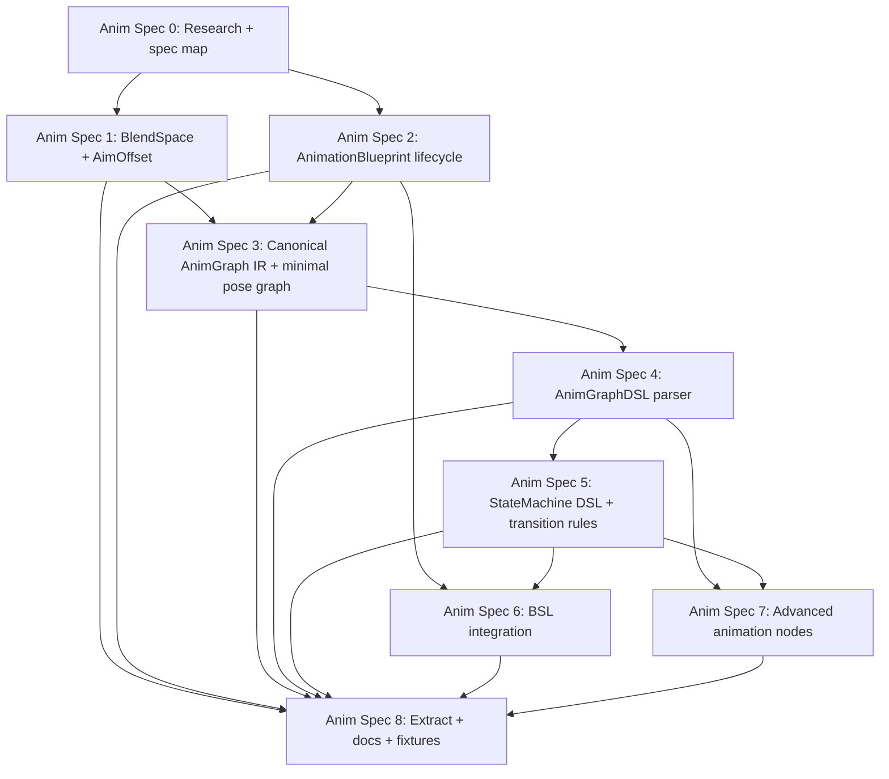

# Animation Generators 规格映射

**日期：** 2026-04-30
**状态：** 供用户审阅的草稿
**分支：** `feature/animation-generators-specs`
**目标：** 将 Animation Blueprint 及相关动画资产生成器工作拆分成小规格，使其可以独立研究、实现、审查和验证。

---

## 1. 总体目标

向 AssetFactory 添加一组动画生成器，使 agents 能够创建、更新、提取和验证 Unreal Engine 动画创作资产：

- `BlendSpace`、`BlendSpace1D`、`AimOffset` 和 `AimOffset1D` 资产。
- 通过官方 AnimBlueprint factory 和 compiler 路径创建的 `AnimationBlueprint` 资产。
- Animation Blueprint 姿势图。
- 动画状态机和过渡规则。
- 通过 BSLFragment 集成的普通 Blueprint/EventGraph/function 逻辑。
- MCP schemas、fixtures、提取和 round-trip 检查。

设计保留 AssetFactory 的顶层输入 JSON。Animation graph 创作委托给专用源码块，因为 AnimGraph 和 StateMachine 语义不适合、也不稳定于低层 JSON node/pin 数组表达。

---

## 2. 契约层

### 顶层 JSON

顶层 JSON 仍然是稳定的 AssetFactory 入口点：

```json
{
  "AssetType": "AnimationBlueprint",
  "Name": "ABP_Enemy",
  "Path": "/Game/Anim",
  "ParentClass": "AnimInstance",
  "Skeleton": "/Game/Characters/SK_Enemy_Skeleton.SK_Enemy_Skeleton",
  "PreviewMesh": "/Game/Characters/SK_Enemy.SK_Enemy",
  "Variables": [
    { "Name": "Speed", "Type": "Float", "DefaultValue": "0.0" },
    { "Name": "bIsInAir", "Type": "Bool", "DefaultValue": "false" }
  ],
  "DefaultProperties": {},
  "AnimGraph": {
    "Language": "AnimGraphDSL",
    "Source": "output = machine Locomotion"
  },
  "StateMachines": [
    {
      "Name": "Locomotion",
      "Language": "AnimStateMachineDSL",
      "Source": "entry Idle\nstate Idle { pose = sequence(\"/Game/Anim/Idle.Idle\") }"
    }
  ],
  "BlueprintGraphs": [
    {
      "Name": "EventGraph",
      "Language": "BSLFragment",
      "Source": "event BlueprintUpdateAnimation(DeltaTimeX: float) { }"
    }
  ]
}
```

顶层 variables 使用现有 `BlueprintGenerator` 形状：`Name`、`Type` 和可选字符串 `DefaultValue`。生成流程应接受 `Bool` 和 `Boolean` 作为 Blueprint bool 变量的别名，因为提取结果可能使用面向引擎的拼写。

### AnimGraph Source

`AnimGraph.Source` 表达姿势图结构。它负责 pose-flow 语义，例如：

- output pose
- sequence player
- blendspace player
- state machine reference
- cached pose
- slot
- layered blend
- raw animation node escape hatch

它不声明普通 Blueprint 变量，也不表达 K2 执行逻辑。

### StateMachine Source

`StateMachines[].Source` 表达动画状态机结构。`StateMachines[].Name` 是权威的机器名来源。如果未来的 DSL header 也命名了该 machine，generator 应拒绝不匹配，而不是隐式选择其中一个。该 source 负责：

- entry state
- states
- state pose expressions
- transitions
- transition blend/crossfade settings
- transition conditions
- 支持时的 nested state machine references

它不直接构建 EventGraph 逻辑。在 Spec 5 中，transition conditions 可以引用 variables、简单 expressions 或 named helper functions，并将它们作为未解析引用保留。Spec 6 负责用 BSLFragment 生成的 functions 满足这些 helper references。

### BlueprintGraphs Source

`BlueprintGraphs[].Source` 使用 `BSLFragment` 表达普通 Blueprint 图逻辑：

- `EventGraph`
- animation update event
- helper functions
- variable update logic
- transition rules 引用的 bool functions

此 source 应尽可能复用 BSL infrastructure，但 Animation Blueprint 图写入仍然需要一个感知 AnimationBlueprint 的 integration layer。当前 BSL parser 期望完整的 `blueprint ... extends ... { ... }` wrapper，因此 Spec 6 负责把 fragments 包装成有效 BSL，并将它们路由到请求的 graph。

---

## 3. 推荐规格

### Anim Spec 0: 研究 + 规格映射 + 语言架构

**目标：** 在实现前记录架构和排序。

范围：

- 记录 BlendSpace 和 AnimationBlueprint 创建所需的 UE API 研究。
- 定义顶层 JSON + AnimGraphDSL + AnimStateMachineDSL + BSLFragment 的拆分。
- 定义依赖顺序和验证期望。
- 识别哪些 specs 是实现规格，哪些是横切规格。

验收：

- 研究和规格映射已提交到隔离 branch/worktree。
- 不修改生产代码。
- 第一个实现目标明确。

依赖：无。

### Anim Spec 1: BlendSpace + AimOffset 生成器

**目标：** 生成独立的 BlendSpace 风格动画资产，供后续 Animation Blueprints 引用。

范围：

- 添加 `AssetType: "BlendSpace"`。
- 支持 `Class`: `BlendSpace`、`BlendSpace1D`、`AimOffset`、`AimOffset1D`。
- 解析 `Skeleton`、可选 `PreviewMesh` 和 `Samples[].Animation`。
- 配置 `BlendParameters`。
- 使用 `UBlendSpace::AddSample` 添加样本。
- 应用样本设置，例如 `RateScale` 和单帧字段。
- 通过反射应用通用 `Properties`。
- 验证样本位置和 AimOffset additive requirements。
- 保存并提取稳定的 generator JSON。

验收：

- 生成空的和带样本的 BlendSpace 资产。
- 生成 1D 和 2D BlendSpace 资产。
- 仅当样本使用兼容 additive settings 时生成 AimOffset。
- 无效 skeleton、animation class、重复 sample point 或无效 AimOffset sample 返回可读错误。
- 当资产类上存在 `RateScale`、`bUseSingleFrameForBlending` 和 `FrameIndexToSample` 等显式设置时，`extract_assets` 发出 `Class`、`Skeleton`、`PreviewMesh`、`BlendParameters`、`Samples` 以及这些设置。

依赖：现有 asset generator framework。

### Anim Spec 2: AnimationBlueprint 生命周期

**目标：** 通过官方 factory 和 compile 路径创建真实的 `UAnimBlueprint` 资产。

范围：

- 添加 `AssetType: "AnimationBlueprint"`。
- 将 `ParentClass` 解析为 `UAnimInstance` 子类。
- 解析必需的 `Skeleton`，除非该规格明确支持 template AnimBlueprints。
- 解析可选 `PreviewMesh`。
- 通过 `UAnimBlueprintFactory` 创建。
- 在有效时复用 Blueprint 风格的 `Variables`、`Interfaces` 和 `DefaultProperties`。
- 使用 `FKismetEditorUtilities::CompileBlueprint` 编译。
- 保存资产并提取生命周期元数据。
- 确保通用 `BlueprintGenerator::CanExtract` 不抢走 `UAnimBlueprint` 提取。

验收：

- 为有效 skeleton 生成空的、已编译的 Animation Blueprint。
- 提取 `ParentClass`、`Skeleton`、`PreviewMesh`、`Variables` 和 `DefaultProperties`。
- 无效 parent class、skeleton 或 preview mesh 返回可读错误。
- 生成的资产可在 Animation Blueprint editor 中打开。

依赖：Anim Spec 0。

### Anim Spec 3: 规范 AnimGraph IR + 最小 Pose Graph

**目标：** 定义并实现第一版语义化 AnimGraph 表示。

范围：

- 定义内部 `FAFAnimGraphSpec`、`FAFAnimPoseNodeSpec` 和 link model。
- 接受规范 JSON AST 形式，用于测试和内部规范化。
- 支持最小 pose graph nodes：
  - sequence player
  - blendspace player
  - state machine reference node
  - output pose
- 尽可能通过 schema/actions/lifecycle APIs 构建 UE AnimGraph nodes。
- 图构建后编译并保存。

验收：

- 生成 sequence player 连接到 output pose 的 `AnimGraph`。
- 生成 BlendSpace player 连接到 output pose 的 `AnimGraph`。
- skeleton 不兼容的 animation assets 在修改图之前被明确拒绝；如果 UE schema helper 静默拒绝创建 node，则通过生成后验证明确拒绝。
- 提取为受支持 nodes 发出规范 graph AST。

依赖：Anim Spec 1、Anim Spec 2。

### Anim Spec 4: AnimGraphDSL Parser

**目标：** 让 agents 以 source text 编写 pose graphs，而不是使用低层 JSON AST。

范围：

- 添加 `AnimGraph.Language = "AnimGraphDSL"`。
- 将 source 解析为 Spec 3 中的规范 AnimGraph IR。
- 为 `sequence`、`blendspace`、`machine`、`cached_pose` 和 `raw_node` 支持一等语法。
- 报告 parser errors，包含源码块、行、列和消息。
- 继续接受规范 JSON AST，用于测试和未来提取。

验收：

- `output = sequence("...")` 构建与规范 JSON 相同的 graph。
- `output = blendspace("...", Speed, Direction)` 构建与规范 JSON 相同的 graph。
- 未知 identifiers 和 malformed syntax 返回本地 diagnostics。

依赖：Anim Spec 3。

### Anim Spec 5: StateMachine DSL + Transition Rules

**目标：** 从语义化源码块生成动画状态机和 transition rule graphs。

范围：

- 添加带有 `Language = "AnimStateMachineDSL"` 的 `StateMachines[]` 源码块。
- 使用 `StateMachines[].Name` 作为 machine identity，然后从 source 解析 entry state、states、state pose expression 和 transitions。
- 使用 UE lifecycle APIs 构建 `UAnimationStateMachineGraph`、state graphs 和 transition graphs。
- 支持基于 variables 的简单 transition expressions。
- 将 named helper calls 作为未解析引用保留，供 Spec 6 满足。
- 配置 transition blend/crossfade settings。

验收：

- 生成带有 variable-based transitions 的两状态 locomotion machine。
- 将 state machine 连接到 AnimGraph output。
- 为受支持 states 和 transitions 提取规范 state machine AST。
- 无效 state references、重复 states 或未知 variables 返回可读错误。

依赖：Anim Spec 2、Anim Spec 3、Anim Spec 4。

### Anim Spec 6: Animation Blueprints 的 BSL 集成

**目标：** 通过 fragment contract，在 Animation Blueprints 内部为普通 Blueprint 逻辑复用 BSL infrastructure。

范围：

- 添加带有 `Language = "BSLFragment"` 的 `BlueprintGraphs[]` 源码块。
- 将 fragments 包装为当前 parser 期望的完整 BSL，然后应用到 Animation Blueprint `EventGraph` 和 helper function graphs。
- 支持 `BlueprintUpdateAnimation` 等 animation events。
- 允许 BSLFragment-generated functions 满足 Spec 5 中的 transition rule helper references。
- 保持 BSLFragment 图逻辑与 AnimGraph pose links 分离。

验收：

- 生成一个 Animation Blueprint，在 `BlueprintUpdateAnimation` 中从 owner velocity 更新 `Speed`。
- 生成被 transition rule 引用的 bool helper function。
- BSL parser/compiler errors 在 fragment wrapping 后标识相关的 `BlueprintGraphs[]` block。

依赖：Anim Spec 2。Transition helper 集成还依赖 Anim Spec 5。

### Anim Spec 7: 高级 Animation Nodes + Raw Escape Hatch

**目标：** 在不硬编码每一种可能 node 的前提下，将 graph authoring 扩展到最小 locomotion 路径之外。

范围：

- 支持 cached poses。
- 支持 slots 和 montage-friendly pose routing。
- 支持 layered blend by bone。
- 支持 aim offset players。
- 如果 engine APIs 允许稳定生成，则支持 linked anim layers 和 input poses。
- 添加 `raw_node` escape hatch，包含动态 class/path 和 reflection properties。

验收：

- 生成 cached-pose graph。
- 生成 slot node graph。
- 生成 layered blend graph。
- Raw node path 可以创建受支持 node，且生产代码中没有针对具体 classes 的 switch statements。

依赖：Anim Spec 3、Anim Spec 4、Anim Spec 5。

### Anim Spec 8: Extract + Round-Trip + MCP Docs + Fixtures

**目标：** 通过 MCP 和 regression fixtures 让动画生成器家族可用且可维护。

范围：

- 添加 `MCP/schemas/BlendSpace.md`。
- 添加 `MCP/schemas/AnimationBlueprint.md`。
- 将 `BlendSpace` 和 `AnimationBlueprint` 添加到 MCP generator asset type list。
- 为每个 spec 添加 positive 和 negative fixtures。
- 为受支持的 BlendSpace、AnimationBlueprint metadata、AnimGraph IR、StateMachine IR 和可行的 BSL-backed graphs 添加提取。
- 添加用于 generate/extract 检查的 smoke scripts。

验收：

- `get_generator_schema(BlendSpace)` 和 `get_generator_schema(AnimationBlueprint)` 可用。
- `generate_assets` 支持两种 asset types。
- Positive fixtures 能编译并保存。
- Negative fixtures 失败且不导致 editor crashes。
- 稳定字段能在 `Generate -> Extract` 后保留。

依赖：所有实现 specs；可随着每个 spec 落地而增量扩展。

---

## 4. 推荐执行顺序



此文档分支之后推荐的第一个实现目标：

1. `BlendSpace + AimOffset Generator`
2. `AnimationBlueprint Lifecycle`
3. `Canonical AnimGraph IR + Minimal Pose Graph`

这能快速产出有用资产，并将 DSL/parser 风险推迟到官方创建路径和 graph lifecycle 路径已经验证之后。

---

## 5. Feature-Complete 定义

动画生成器家族在满足以下条件时视为 feature-complete：

- agents 能够创建带有已验证样本的 BlendSpace 和 AimOffset 资产；
- agents 能够创建绑定到 skeletons 的真实、已编译 Animation Blueprints；
- agents 能够表达 pose graphs，而无需编写 UE pin-level JSON；
- agents 能够以语义化方式表达 state machines 和 transition rules；
- 普通 Blueprint 逻辑通过 BSLFragment 或 BSL-compatible infrastructure 处理；
- 生成的资产能在 UE editor views 中打开，无需手动修复；
- extract 能为受支持 features 返回稳定、generator-readable 的 JSON/IR；
- MCP schemas 和 fixtures 对契约的解释足够清晰，使另一个 agent 可以继续推进。
