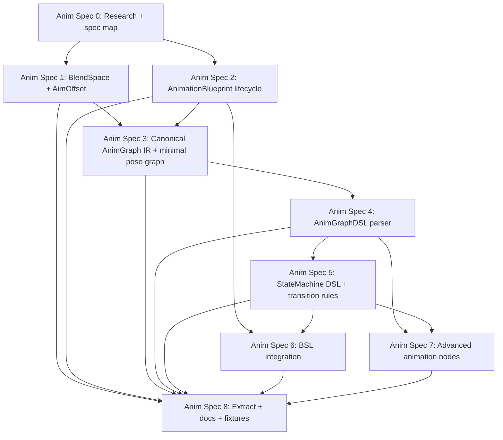

# Animation Generators Spec Map

**Date:** 2026-04-30
**Status:** Draft for user review
**Branch:** `feature/animation-generators-specs`
**Goal:** Split the Animation Blueprint and related animation asset generator work into small specs that can be researched, implemented, reviewed, and verified independently.

---

## 1. Overall Goal

Add an animation generator family to AssetFactory so agents can create, update, extract, and verify Unreal Engine animation authoring assets:

- `BlendSpace`, `BlendSpace1D`, `AimOffset`, and `AimOffset1D` assets.
- `AnimationBlueprint` assets created through the official AnimBlueprint factory and compiler path.
- Animation Blueprint pose graphs.
- Animation state machines and transition rules.
- Ordinary Blueprint/EventGraph/function logic through BSLFragment integration.
- MCP schemas, fixtures, extraction, and round-trip checks.

The design keeps AssetFactory's top-level input JSON. Animation graph authoring is delegated to dedicated source blocks, because AnimGraph and StateMachine semantics are not comfortable or stable as low-level JSON node/pin arrays.

---

## 2. Contract Layers

### Top-Level JSON

Top-level JSON remains the stable AssetFactory entry point:

```json
{
  "AssetType": "AnimationBlueprint",
  "Name": "ABP_Enemy",
  "Path": "/Game/Anim",
  "ParentClass": "AnimInstance",
  "Skeleton": "/Game/Characters/SK_Enemy_Skeleton.SK_Enemy_Skeleton",
  "PreviewMesh": "/Game/Characters/SK_Enemy.SK_Enemy",
  "Variables": [
    { "Name": "Speed", "Type": "Float", "DefaultValue": "0.0" },
    { "Name": "bIsInAir", "Type": "Bool", "DefaultValue": "false" }
  ],
  "DefaultProperties": {},
  "AnimGraph": {
    "Language": "AnimGraphDSL",
    "Source": "output = machine Locomotion"
  },
  "StateMachines": [
    {
      "Name": "Locomotion",
      "Language": "AnimStateMachineDSL",
      "Source": "entry Idle\nstate Idle { pose = sequence(\"/Game/Anim/Idle.Idle\") }"
    }
  ],
  "BlueprintGraphs": [
    {
      "Name": "EventGraph",
      "Language": "BSLFragment",
      "Source": "event BlueprintUpdateAnimation(DeltaTimeX: float) { }"
    }
  ]
}
```

Top-level variables use the existing `BlueprintGenerator` shape: `Name`, `Type`, and optional string `DefaultValue`. Generation should accept `Bool` and `Boolean` aliases for Blueprint bool variables because extraction may use engine-facing spellings.

### AnimGraph Source

`AnimGraph.Source` expresses pose graph structure. It owns pose-flow semantics such as:

- output pose
- sequence player
- blendspace player
- state machine reference
- cached pose
- slot
- layered blend
- raw animation node escape hatch

It does not declare ordinary Blueprint variables and does not express K2 execution logic.

### StateMachine Source

`StateMachines[].Source` expresses animation state machine structure. `StateMachines[].Name` is the authoritative machine name. If a future DSL header also names the machine, the generator should reject mismatches rather than picking one implicitly. The source owns:

- entry state
- states
- state pose expressions
- transitions
- transition blend/crossfade settings
- transition conditions
- nested state machine references when supported

It does not build EventGraph logic directly. In Spec 5, transition conditions may reference variables, simple expressions, or named helper functions as unresolved references. Spec 6 is responsible for satisfying those helper references from BSLFragment-generated functions.

### BlueprintGraphs Source

`BlueprintGraphs[].Source` uses `BSLFragment` for ordinary Blueprint graph logic:

- `EventGraph`
- animation update event
- helper functions
- variable update logic
- bool functions referenced by transition rules

This source should reuse BSL infrastructure where possible, but Animation Blueprint graph writing still needs an AnimationBlueprint-aware integration layer. The current BSL parser expects a full `blueprint ... extends ... { ... }` wrapper, so Spec 6 owns wrapping fragments into valid BSL and routing them to the requested graph.

---

## 3. Recommended Specs

### Anim Spec 0: Research + Spec Map + Language Architecture

**Goal:** Document the architecture and sequencing before implementation.

Scope:

- Record UE API research for BlendSpace and AnimationBlueprint creation.
- Define the top-level JSON + AnimGraphDSL + AnimStateMachineDSL + BSLFragment split.
- Define dependency order and verification expectations.
- Identify which specs are implementation specs and which are cross-cutting specs.

Acceptance:

- Research and spec map are committed on an isolated branch/worktree.
- No production code changes.
- The first implementation target is explicit.

Dependencies: none.

### Anim Spec 1: BlendSpace + AimOffset Generator

**Goal:** Generate independent BlendSpace-style animation assets that later Animation Blueprints can reference.

Scope:

- Add `AssetType: "BlendSpace"`.
- Support `Class`: `BlendSpace`, `BlendSpace1D`, `AimOffset`, `AimOffset1D`.
- Resolve `Skeleton`, optional `PreviewMesh`, and `Samples[].Animation`.
- Configure `BlendParameters`.
- Add samples with `UBlendSpace::AddSample`.
- Apply sample settings such as `RateScale` and single-frame fields.
- Apply general `Properties` through reflection.
- Validate sample positions and AimOffset additive requirements.
- Save and extract stable generator JSON.

Acceptance:

- Generate empty and sampled BlendSpace assets.
- Generate 1D and 2D BlendSpace assets.
- Generate AimOffset only when samples use compatible additive settings.
- Invalid skeleton, animation class, duplicate sample point, or invalid AimOffset sample returns readable errors.
- `extract_assets` emits `Class`, `Skeleton`, `PreviewMesh`, `BlendParameters`, `Samples`, and explicit settings such as `RateScale`, `bUseSingleFrameForBlending`, and `FrameIndexToSample` when present on the asset class.

Dependencies: existing asset generator framework.

### Anim Spec 2: AnimationBlueprint Lifecycle

**Goal:** Create a real `UAnimBlueprint` asset through official factory and compile paths.

Scope:

- Add `AssetType: "AnimationBlueprint"`.
- Resolve `ParentClass` as `UAnimInstance` subclass.
- Resolve required `Skeleton` unless the spec explicitly supports template AnimBlueprints.
- Resolve optional `PreviewMesh`.
- Create through `UAnimBlueprintFactory`.
- Reuse Blueprint-style `Variables`, `Interfaces` where valid, and `DefaultProperties`.
- Compile with `FKismetEditorUtilities::CompileBlueprint`.
- Save asset and extract lifecycle metadata.
- Ensure generic `BlueprintGenerator::CanExtract` does not steal `UAnimBlueprint` extraction.

Acceptance:

- Generate an empty compiled Animation Blueprint for a valid skeleton.
- Extract `ParentClass`, `Skeleton`, `PreviewMesh`, `Variables`, and `DefaultProperties`.
- Invalid parent class, skeleton, or preview mesh returns readable errors.
- The generated asset opens in the Animation Blueprint editor.

Dependencies: Anim Spec 0.

### Anim Spec 3: Canonical AnimGraph IR + Minimal Pose Graph

**Goal:** Define and implement the first semantic AnimGraph representation.

Scope:

- Define internal `FAFAnimGraphSpec`, `FAFAnimPoseNodeSpec`, and link model.
- Accept a canonical JSON AST form for tests and internal normalization.
- Support minimal pose graph nodes:
  - sequence player
  - blendspace player
  - state machine reference node
  - output pose
- Build UE AnimGraph nodes through schema/actions/lifecycle APIs where possible.
- Compile and save after graph build.

Acceptance:

- Generate `AnimGraph` where a sequence player connects to output pose.
- Generate `AnimGraph` where a BlendSpace player connects to output pose.
- Skeleton-incompatible animation assets are rejected clearly before graph mutation, or by post-spawn verification if a UE schema helper silently refuses to create a node.
- Extract emits canonical graph AST for supported nodes.

Dependencies: Anim Spec 1, Anim Spec 2.

### Anim Spec 4: AnimGraphDSL Parser

**Goal:** Let agents write pose graphs as source text instead of low-level JSON AST.

Scope:

- Add `AnimGraph.Language = "AnimGraphDSL"`.
- Parse source into the canonical AnimGraph IR from Spec 3.
- Support first-class syntax for `sequence`, `blendspace`, `machine`, `cached_pose`, and `raw_node`.
- Report parser errors with source block, line, column, and message.
- Keep canonical JSON AST accepted for tests and future extraction.

Acceptance:

- `output = sequence("...")` builds the same graph as canonical JSON.
- `output = blendspace("...", Speed, Direction)` builds the same graph as canonical JSON.
- Unknown identifiers and malformed syntax return local diagnostics.

Dependencies: Anim Spec 3.

### Anim Spec 5: StateMachine DSL + Transition Rules

**Goal:** Generate animation state machines and transition rule graphs from a semantic source block.

Scope:

- Add `StateMachines[]` source blocks with `Language = "AnimStateMachineDSL"`.
- Use `StateMachines[].Name` as the machine identity, then parse entry state, states, state pose expression, and transitions from source.
- Build `UAnimationStateMachineGraph`, state graphs, and transition graphs using UE lifecycle APIs.
- Support simple transition expressions over variables.
- Preserve named helper calls as unresolved references that Spec 6 can satisfy.
- Configure transition blend/crossfade settings.

Acceptance:

- Generate a two-state locomotion machine with variable-based transitions.
- Connect the state machine to AnimGraph output.
- Extract canonical state machine AST for supported states and transitions.
- Invalid state references, duplicate states, or unknown variables return readable errors.

Dependencies: Anim Spec 2, Anim Spec 3, Anim Spec 4.

### Anim Spec 6: BSL Integration For Animation Blueprints

**Goal:** Reuse BSL infrastructure for ordinary Blueprint logic inside Animation Blueprints through a fragment contract.

Scope:

- Add `BlueprintGraphs[]` source blocks with `Language = "BSLFragment"`.
- Wrap fragments into full BSL expected by the current parser, then apply them to Animation Blueprint `EventGraph` and helper function graphs.
- Support animation events such as `BlueprintUpdateAnimation`.
- Allow BSLFragment-generated functions to satisfy transition rule helper references from Spec 5.
- Keep BSLFragment graph logic separate from AnimGraph pose links.

Acceptance:

- Generate an Animation Blueprint that updates `Speed` from owner velocity in `BlueprintUpdateAnimation`.
- Generate a bool helper function referenced by a transition rule.
- BSL parser/compiler errors identify the relevant `BlueprintGraphs[]` block after fragment wrapping.

Dependencies: Anim Spec 2. Transition helper integration additionally depends on Anim Spec 5.

### Anim Spec 7: Advanced Animation Nodes + Raw Escape Hatch

**Goal:** Expand graph authoring beyond the minimal locomotion path without hard-coding every possible node.

Scope:

- Support cached poses.
- Support slots and montage-friendly pose routing.
- Support layered blend by bone.
- Support aim offset players.
- Support linked anim layers and input poses if engine APIs allow stable generation.
- Add `raw_node` escape hatch with dynamic class/path and reflection properties.

Acceptance:

- Generate a cached-pose graph.
- Generate a slot node graph.
- Generate a layered blend graph.
- Raw node path can create a supported node without production code switch statements for concrete classes.

Dependencies: Anim Spec 3, Anim Spec 4, Anim Spec 5.

### Anim Spec 8: Extract + Round-Trip + MCP Docs + Fixtures

**Goal:** Make the animation generator family usable and maintainable through MCP and regression fixtures.

Scope:

- Add `MCP/schemas/BlendSpace.md`.
- Add `MCP/schemas/AnimationBlueprint.md`.
- Add `BlendSpace` and `AnimationBlueprint` to MCP generator asset type list.
- Add positive and negative fixtures for every spec.
- Add extraction for supported BlendSpace, AnimationBlueprint metadata, AnimGraph IR, StateMachine IR, and BSL-backed graphs where feasible.
- Add smoke scripts for generate/extract checks.

Acceptance:

- `get_generator_schema(BlendSpace)` and `get_generator_schema(AnimationBlueprint)` work.
- `generate_assets` supports both asset types.
- Positive fixtures compile and save.
- Negative fixtures fail without editor crashes.
- Stable fields survive `Generate -> Extract`.

Dependencies: all implementation specs; can be expanded incrementally as each spec lands.

---

## 4. Recommended Execution Order



Recommended first implementation target after this documentation branch:

1. `BlendSpace + AimOffset Generator`
2. `AnimationBlueprint Lifecycle`
3. `Canonical AnimGraph IR + Minimal Pose Graph`

This gives useful assets quickly and delays the DSL/parser risk until the official creation and graph lifecycle paths are proven.

---

## 5. Feature-Complete Definition

The animation generator family is feature-complete when:

- agents can create BlendSpace and AimOffset assets with validated samples;
- agents can create real compiled Animation Blueprints tied to skeletons;
- agents can express pose graphs without writing UE pin-level JSON;
- agents can express state machines and transition rules semantically;
- ordinary Blueprint logic is handled through BSLFragment or BSL-compatible infrastructure;
- generated assets open in UE editor views without manual repair;
- extract can return stable generator-readable JSON/IR for supported features;
- MCP schemas and fixtures explain the contracts well enough for another agent to continue.
