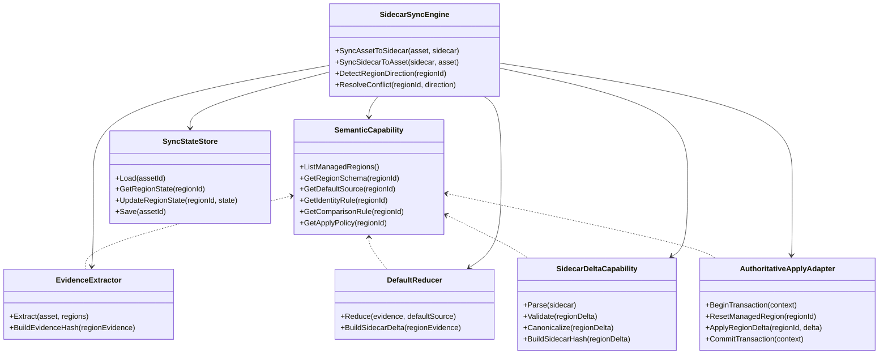
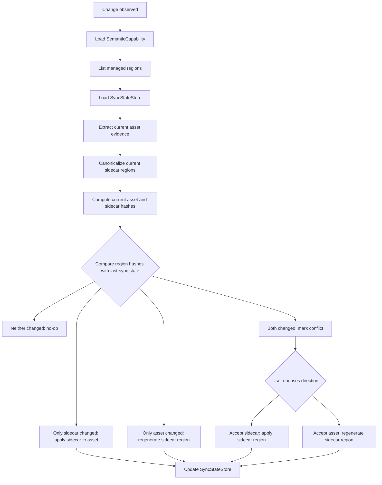
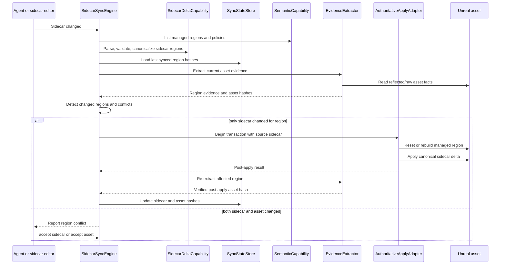

# AssetDocument Bidirectional Delta Sidecar Goal

## Goal

AssetDocument should evolve into a bidirectional delta sidecar system.

The sidecar file is the maintained authoring surface. It records persistent asset differences from a default or baseline state, similar in spirit to text resource files such as Godot `.tres`. Agents edit the sidecar directly. Users may also edit the Unreal asset directly in the editor. The system keeps both representations synchronized.

## Core Model

AssetDoc is not a one-shot operation log and should not expose an agent-facing patch or command DSL.

AssetDoc is also not intended to become a full serialized copy of every Unreal asset field. It should record effective, meaningful differences that need to persist.

The intended model is:

```text
default or baseline asset state
+ AssetDoc sidecar delta
= desired Unreal asset state
```

When the Unreal asset changes, extractors and reducers update the sidecar so the sidecar reflects the current meaningful differences. When the sidecar changes, apply adapters update the Unreal asset so the asset reflects the sidecar.

## Field Absence Semantics

In this model, a missing field in the sidecar does not mean "leave the current Unreal asset value untouched."

A missing field means the sidecar does not declare a persistent difference for that field or region. During sidecar-to-asset synchronization, the affected managed field or region should return to its default or baseline representation before sidecar values are applied.

This differs from sparse one-shot patch semantics. The sidecar is a source-of-truth delta, not an imperative partial update.

This rule only applies inside regions declared as AssetDoc-managed. Unmanaged Unreal asset data is outside the synchronization scope and must be preserved by sidecar-to-asset application. A missing sidecar field must never be interpreted as permission to reset unrelated asset state.

## Managed Region Scope

`SemanticCapability` declares the managed region list for each supported asset shape. Every extractor, reducer, sync decision, and apply operation is scoped to those regions.

For AnimMontage, version 1 should avoid one coarse `Body` region. A more useful region split is:

- `Body.Blend`
- `Body.SlotTracks`
- `Body.CompositeSections`
- `Body.Notifies`
- `Body.Curves`
- `Body.RootMotion`

This keeps the conflict model region-level while avoiding unnecessary conflicts when the sidecar and Unreal editor changed unrelated parts of the same asset. For example, a sidecar edit to `Body.Blend` should not conflict with an editor edit to `Body.Notifies` if both regions have independent sync state.

## Architecture Overview

The architecture should keep extraction, reduction, sidecar validation, synchronization, and application as separate responsibilities.

```text
Unreal asset, reflected data, raw dumps, text exports
  -> EvidenceExtractor
  -> EvidenceBundle
  -> DefaultReducer
  -> AssetDoc sidecar delta

AssetDoc sidecar delta
  -> SidecarDeltaCapability
  -> AuthoritativeApplyAdapter
  -> Unreal asset

SidecarSyncEngine coordinates both directions with SyncStateStore-backed per-region sync state.
```

The important boundary is that the sidecar remains the authoring surface. The internal system may compute deltas, hashes, or rebuild instructions, but agents still edit AssetDoc content rather than an operation language.

## Architecture Class Diagram



## Region-Level Synchronization

For version 1, complex structured regions should prefer region-level regeneration over element-level merging.

Examples:

- If `Body.Notifies` changes in the Unreal asset, regenerate the sidecar's `Body.Notifies` region from extracted facts and reduced defaults.
- If `Body.Notifies` changes in the sidecar, rebuild the Unreal asset's notifies region from the sidecar representation.
- The same default approach applies to structured regions such as `CompositeSections`, `SlotAnimTracks`, `NotifyStates`, and similar future graph or timeline regions.

Identity remains useful for stable output, reduced textual churn, and future conflict detection, but it should not force version 1 into a complex element-level merge engine.

## Canonical Hashing

Conflict detection depends on canonical region hashes, not raw text comparison or raw UObject memory comparison.

`SidecarDeltaCapability` is responsible for canonicalizing sidecar regions before hashing. Canonicalization should remove formatting differences, normalize ordering where ordering is not semantic, normalize omitted-default forms, and use stable field names from the AssetDoc schema.

`EvidenceExtractor` and `DefaultReducer` are responsible for producing canonical asset evidence hashes. These hashes should represent the meaningful extracted state for a managed region after applying the same semantic comparison rules declared by `SemanticCapability`.

Canonical hash rules must be owned per region. For example, montage section order may be semantic, while object property key order in the sidecar is not.

## Sync State Store

`SidecarSyncEngine` cannot detect direction or conflicts from the current sidecar and current asset alone. It requires persistent last-sync state.

`SyncStateStore` stores per managed region:

- region id
- last synced sidecar hash
- last synced asset evidence hash
- last sync revision or timestamp
- last accepted direction

The state may be stored in sidecar metadata or in a companion state file, but it must be associated with the sidecar and asset identity. The first implementation can choose one storage mechanism, but the architecture requires the state to be explicit.

When a region successfully syncs in either direction, `SidecarSyncEngine` updates the sidecar hash and asset evidence hash together. If a sync operation fails before both representations are stable, the previous state must remain intact so the next sync can retry or report the same conflict.

## Region-Level Conflict Resolution

Conflict detection is owned by `SidecarSyncEngine`, not by individual element adapters.

For each managed region, the sync engine tracks enough state to compare:

- the last synced sidecar region hash
- the last synced asset evidence hash
- the current sidecar region hash
- the current asset evidence hash

The direction rules are:

- If only the sidecar region changed, synchronize sidecar to asset.
- If only the asset evidence changed, synchronize asset to sidecar.
- If neither changed, do nothing.
- If both changed, mark the region as conflicted.

Version 1 conflict resolution is intentionally directional:

- `accept sidecar`: the sidecar wins. Apply the sidecar region to the Unreal asset, then update the region sync state.
- `accept asset`: the Unreal asset wins. Regenerate the sidecar region from current asset evidence, then update the region sync state.

There is no element-level three-way merge in the first version. For example, if both `Body.Notifies` in the sidecar and the montage notifies in the Unreal asset changed since the last sync, version 1 does not try to merge individual notify rows. It asks for a region-level direction and then rebuilds that region from the chosen side.

## Direction Detection Flow



## Sidecar To Asset Sequence



## Sync Transactions And Loop Prevention

Bidirectional synchronization must distinguish user/editor changes from changes produced by the sync engine itself.

`SidecarSyncEngine` should create a sync transaction for every apply or regenerate operation. The transaction records:

- source direction, such as sidecar, asset, accept sidecar, or accept asset
- affected regions
- expected post-operation sidecar hashes
- expected post-operation asset evidence hashes

If applying a sidecar change causes an Unreal asset save event, the next sync pass should compare the event against the active or recently completed transaction. If the resulting asset hash matches the expected post-apply hash, it is not a new user conflict; it is the expected result of the previous sync.

Transactions should be short-lived and region-scoped. They are not an operation log for agents and should not become the authoring format.

## Identity Preference

Use Unreal's native stable identity when it exists.

For AnimMontage, `FAnimNotifyEvent::Guid` is available under editor-only data and should be preferred for notify identity in editor-side synchronization. For structures without native GUIDs, use semantic identity such as `SectionName` or `SlotName` where valid. Only introduce AssetDoc-owned metadata or generated IDs when Unreal does not provide a reliable identity and semantic identity is insufficient.

## Responsibility Split

The target architecture is:

- `EvidenceExtractor`: reads low-level facts from Unreal assets, reflected data, raw dumps, or text exports. It may be dirty and debug-oriented, but it should not decide authoring semantics. It should emit region evidence and stable evidence hashes where possible.
- `DefaultReducer`: compares extracted facts against the selected default source, such as CDO values, empty templates, current asset baselines, or profile-declared defaults. It outputs only effective sidecar deltas.
- `SemanticCapability`: declares sidecar-visible regions, stable keys, default sources, identity rules, comparison rules, constraints, synchronization scope, and whether a region is rebuilt as a whole in version 1.
- `SidecarDeltaCapability`: validates and normalizes sidecar delta content. It understands the AssetDoc-native schema, but it does not expose an agent-facing patch or command DSL.
- `SyncStateStore`: persists last-sync sidecar and asset evidence hashes per managed region. It makes direction detection and conflict detection reliable across editor restarts and separate agent runs.
- `SidecarSyncEngine`: coordinates asset-to-sidecar and sidecar-to-asset synchronization. It owns direction detection, conflict marking, sync transactions, loop prevention, and `accept sidecar` / `accept asset` resolution.
- `AuthoritativeApplyAdapter`: writes normalized sidecar deltas back to Unreal objects. It resets or rebuilds managed fields and regions before applying sidecar values, because applying is not the reverse of extraction.

Existing full Body replacement behavior can remain as a compatibility layer, but it should not be the long-term authoring model.

## Non-Goals

- Do not introduce an agent-facing patch operation language as the primary authoring surface.
- Do not treat raw `.uasset`, raw JSON dumps, or text exports as direct authoring formats.
- Do not grow one-off per-asset interpreters when a shared extractor, reducer, semantic capability, or apply adapter can cover the behavior.
- Do not require element-level merge for the first version of bidirectional synchronization.
- Do not guess region conflicts from array index, timestamp, class name, or other unstable element-level heuristics when a simple directional resolution is enough.
- Do not let synchronization transactions become agent-authored operations or long-term edit history.
