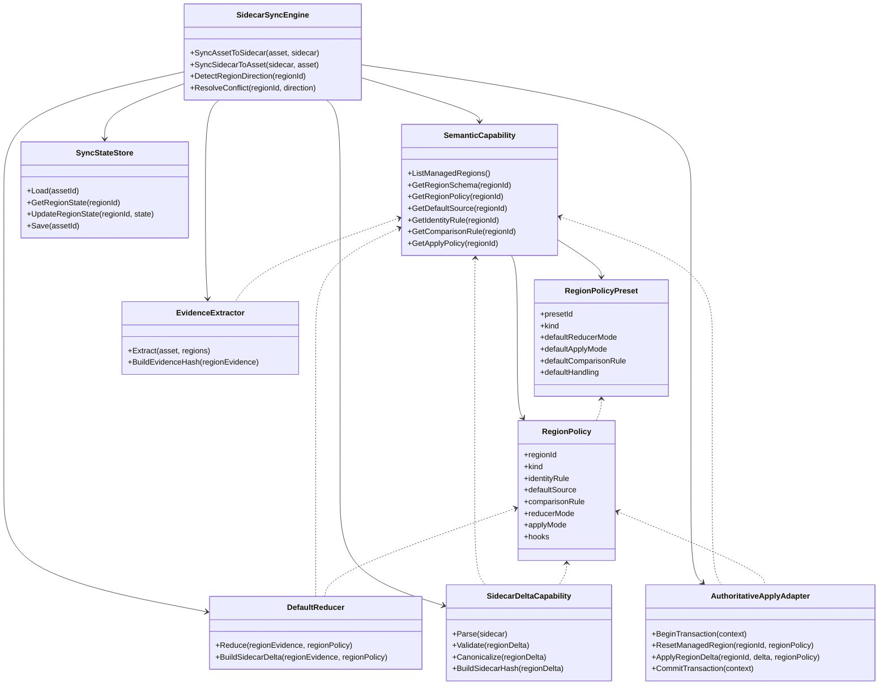
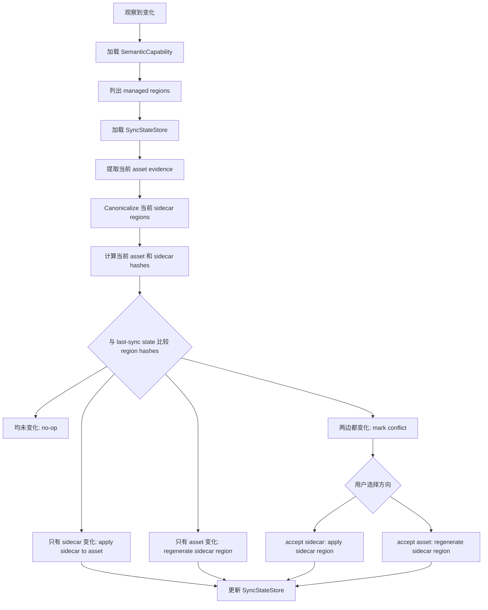
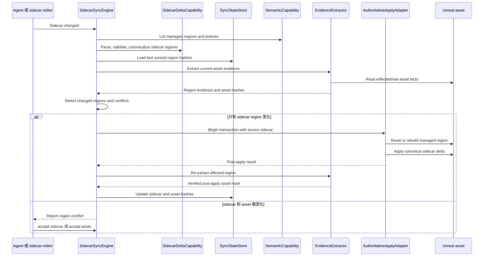

# AssetDocument 双向 Delta Sidecar 目标

## 目标

AssetDocument 应演进为一个双向 delta sidecar 系统。

Sidecar 文件是长期维护的作者编辑面。它记录资产相对于默认状态或基线状态的持久化差异，整体思路接近 Godot `.tres` 这类文本资源文件。Agent 直接编辑 sidecar。用户也可以直接在 Unreal Editor 里编辑 Unreal asset。系统负责让这两种表示保持同步。

## 核心模型

AssetDoc 不是一次性的操作日志，也不应该向 agent 暴露 patch 或 command DSL。

AssetDoc 也不应该变成 Unreal asset 每个字段的完整序列化副本。它应该记录需要持久化的、有效的、有意义的差异。

目标模型是：

```text
默认或基线资产状态
+ AssetDoc sidecar delta
= 期望的 Unreal asset 状态
```

当 Unreal asset 发生变化时，extractor 和 reducer 更新 sidecar，让 sidecar 反映当前有意义的差异。当 sidecar 发生变化时，apply adapter 更新 Unreal asset，让 asset 反映 sidecar。

## 字段缺失语义

在这个模型里，sidecar 中缺失某个字段，并不表示“保持当前 Unreal asset 的值不变”。

缺失字段表示 sidecar 没有为该字段或 region 声明持久化差异。在 sidecar-to-asset 同步时，受影响的 managed field 或 managed region 应先回到默认或基线表示，然后再应用 sidecar 中声明的值。

这不同于 sparse one-shot patch 语义。Sidecar 是 source-of-truth delta，不是命令式的局部更新。

这条规则只作用于声明为 AssetDoc-managed 的 region。未被管理的 Unreal asset 数据不在同步范围内，sidecar-to-asset apply 必须保留它们。Sidecar 缺失某个字段，绝不能被解释为允许重置无关资产状态。

## Managed Region 范围

`SemanticCapability` 为每一种受支持的资产形态声明 managed region 列表。每个 extractor、reducer、sync decision 和 apply operation 都必须限制在这些 region 内。

对于 AnimMontage，v1 不应该只使用一个过粗的 `Body` region。更合适的 region 拆分是：

- `Body.Blend`
- `Body.SlotTracks`
- `Body.CompositeSections`
- `Body.Notifies`
- `Body.Curves`
- `Body.RootMotion`

这样仍然保持 region-level conflict model，但可以避免 sidecar 和 Unreal Editor 修改了同一资产的无关部分时产生不必要冲突。例如，sidecar 修改 `Body.Blend`，editor 修改 `Body.Notifies`，只要两个 region 拥有独立 sync state，就不应该互相冲突。

当前 implementation task 已落地的 AnimMontage managed region 是：

- `Body.Blend`
- `Body.SlotAnimTracks`
- `Body.CompositeSections`
- `Body.Notifies`
- `Body.NotifyStates`

`Body.Curves` 和 `Body.RootMotion` 仍然属于目标方向，但本轮没有实现对应 extractor/reducer/apply policy 和 automation。后续 task 需要先明确 Unreal AnimMontage 中 curve/root motion 的真实字段、默认来源、比较规则和保留策略，再加入 managed region policy。

## 架构概览

架构应保持 extraction、reduction、sidecar validation、synchronization 和 application 的职责分离。

```text
Unreal asset、reflected data、raw dump、text export
  -> EvidenceExtractor
  -> EvidenceBundle
  -> DefaultReducer
  -> AssetDoc sidecar delta

AssetDoc sidecar delta
  -> SidecarDeltaCapability
  -> AuthoritativeApplyAdapter
  -> Unreal asset

SidecarSyncEngine 使用 SyncStateStore 支撑的 per-region sync state 协调双向同步。
```

最重要的边界是：sidecar 仍然是作者编辑面。系统内部可以计算 delta、hash 或 rebuild instruction，但 agent 仍然编辑 AssetDoc 内容，而不是编辑操作语言。

## RegionPolicy 驱动的 Reducer 和 Apply

`DefaultReducer` 和 `AuthoritativeApplyAdapter` 不应该按每一种结构体或每一种资产类型扩张成大量专用类。否则 `NotifyTimelineReducer`、`SlotTrackReducer`、`MontageSectionReducer` 这类拆法会退化成“一种结构一个 reducer / adapter”，只是把 per-asset interpreter 换了一个名字。

更合适的方向是：少量通用 reducer/apply engine，加数据化的 `RegionPolicy`，必要时再挂极少量 custom hook。

`RegionPolicy` 由 `SemanticCapability` 提供，声明每个 managed region 的行为：

```yaml
Body.Notifies:
  kind: array
  identity: guid
  defaultSource: empty
  compare:
    order: semantic
    omitDefaults: true
    numericTolerance: 0.001
  reducer:
    mode: GenericArrayDelta
  apply:
    mode: RebuildArrayRegion
    targetProperty: Notifies
    elementFactory: /Script/Engine.AnimNotifyEvent
    afterApplyHook: RefreshAnimMontageNotifyData
```

`RegionPolicy` 可以直接声明，也可以由 `RegionPolicyPreset` 加 profile overrides 展开得到。Preset 不是 C++ template，也不是代码生成体系；它是 profile/schema 层的 policy 复用机制，用来避免每个 region 重复声明 reducer mode、apply mode、comparison rule 和 default handling。

`RegionPolicyPreset` 解决的是配置重复和语义一致性问题。它不会改变运行时架构：`SemanticCapability` 在解析 profile/schema 时先展开 preset 和 overrides，运行时的 `DefaultReducer`、`SidecarDeltaCapability`、`AuthoritativeApplyAdapter` 仍然只消费完整的 `RegionPolicy`。

使用 preset 后，同类 region 可以共享一套默认语义。例如所有 reflected scalar CDO delta region 都天然使用 CDO default source、`GenericScalarDelta`、`SetScalarProperty` 和 `omitDefaults`。如果以后这类 region 需要统一增加 float tolerance 或 canonical rule，只需要改 preset，而不是逐个修改 region 声明。

推荐分工是：

```text
UE reflection
  提供原始 property 能力：字段、类型、读写、CDO/default。

RegionPolicyPreset
  提供常见作者语义预设：scalar delta、struct delta、array-by-identity、map delta、graph region。

AssetDoc profile/schema
  选择预设并覆盖 region 名称、targetProperty、identity field、display schema、hook 等资产语义。

SpecializedSemanticExtension
  只补 reflection、preset、profile 都表达不了的 engine-specific repair 或结构语义。
```

示例：

```yaml
presets:
  reflectedScalar:
    kind: scalar
    reducer:
      mode: GenericScalarDelta
    apply:
      mode: SetScalarProperty
    compare:
      omitDefaults: true

  reflectedArrayByGuid:
    kind: array
    identity:
      mode: field
      field: Guid
    reducer:
      mode: GenericArrayDelta
    apply:
      mode: RebuildArrayRegion
    compare:
      omitDefaults: true
      order: semantic

regions:
  Body.Blend.In:
    preset: reflectedScalar
    targetProperty: BlendIn

  Body.Notifies:
    preset: reflectedArrayByGuid
    targetProperty: Notifies
    elementType: /Script/Engine.AnimNotifyEvent
    afterApplyHook: RefreshAnimMontageNotifyData
```

原则是：reflection for facts，preset/profile for semantics，extension hook for engine-specific repairs。

`DefaultReducer` 应更像一个通用 delta engine。它读取 `RegionPolicy`，然后按 region kind、identity、default source 和 comparison rules 对齐 evidence 与 baseline，省略默认值，输出 sidecar delta。它不应该因为 region 名叫 `Body.Notifies` 就天然要求一个 `NotifyTimelineReducer` 类。

`AuthoritativeApplyAdapter` 也应优先使用少量通用 apply mode，例如：

- `SetScalarProperty`
- `SetStructProperty`
- `RebuildArrayRegion`
- `RebuildMapRegion`
- `RebuildGraphRegion`

只有当 UE API 不是普通反射可写、某个 region apply 后必须调用专门修复逻辑，或者数据位于 editor-only / derived / cached structure 中时，才通过 `RegionPolicy` 挂 custom hook。Custom hook 是通用机制的逃生口，不是默认扩展方式。

## Godot 对照结论

这个方向与 Godot 的资源序列化组织方式一致。Godot 并不是为每一种 resource type 创建一个完整的 `XxxSemanticCapability`。它主要依赖对象属性系统提供通用语义：resource class 通过 `get_property_list()`、property usage、type、hint 等 metadata 描述可保存属性，通用 `.tres` / `.tscn` loader 和 saver 再按这些 property metadata 进行 parse、`set`、`get` 和 save。

对应到 AssetDocument：

```text
Godot get_property_list / PropertyInfo / usage
≈ UE reflection + AssetDoc profile/schema + RegionPolicy

Godot ResourceFormatLoaderText / ResourceFormatSaverText
≈ GenericSemanticCapability + 通用 reducer/apply engine

Godot 特殊 scene tags: node / connection / editable
≈ SpecializedSemanticExtension / custom hook

Godot PROPERTY_USAGE_STORAGE
≈ managed region / managed field scope
```

因此 `GenericSemanticCapability` 应像 Godot 的 property serialization layer：通过 UE reflection、property metadata、AssetDoc profile/schema 生成 `RegionPolicy`。`SpecializedSemanticExtension` 只补充通用 property policy 表达不了的结构语义，例如 timeline ordering、section relink、notify refresh 或 graph node rebuild hook。

我们的系统比 Godot `.tres` 多出 delta reduction、sync state 和 conflict policy，因为 AssetDocument 不是单纯保存当前资源状态，而是保存相对默认或基线的有效差异，并支持 sidecar 与 Unreal asset 双向同步。这个差异不改变通用层组织原则：不要为每类 asset 创建完整 semantic capability，也不要为每种结构创建专用 reducer / adapter。

## 架构类图



## Region-Level 同步

v1 中，复杂结构化 region 应优先采用 region-level regeneration，而不是 element-level merge。

示例：

- 如果 Unreal asset 中的 `Body.Notifies` 发生变化，则根据 extracted facts 和 reduced defaults 重新生成 sidecar 的 `Body.Notifies` region。
- 如果 sidecar 中的 `Body.Notifies` 发生变化，则根据 sidecar 表示重建 Unreal asset 的 notifies region。
- 同样的默认策略适用于 `CompositeSections`、`SlotAnimTracks`、`NotifyStates` 以及未来类似的 graph 或 timeline region。

Identity 对稳定输出、减少文本 churn 和未来 conflict detection 仍然有价值，但它不应该迫使 v1 实现复杂的 element-level merge engine。

## Canonical Hashing

冲突检测依赖 canonical region hash，而不是 raw text comparison 或 raw UObject memory comparison。

`SidecarDeltaCapability` 负责在 hash 前 canonicalize sidecar region。Canonicalization 应移除格式差异，在排序不具备语义时规范排序，规范 omitted-default 表示，并使用 AssetDoc schema 中的稳定字段名。

`EvidenceExtractor` 和 `DefaultReducer` 负责生成 canonical asset evidence hash。这些 hash 应在应用 `SemanticCapability` 声明的同一套 semantic comparison rules 后，表示 managed region 的有意义 extracted state。

Canonical hash 规则必须按 region 归属。例如，montage section order 可能具备语义，而 sidecar 中 object property key order 不具备语义。

## Sync State Store

`SidecarSyncEngine` 不能只靠当前 sidecar 和当前 asset 判断方向或冲突。它需要持久化的 last-sync state。

`SyncStateStore` 为每个 managed region 存储：

- region id
- last synced sidecar hash
- last synced asset evidence hash
- last sync revision 或 timestamp
- last accepted direction

v1 默认将状态存储在 sidecar metadata 的 `_meta.sync` 区域中，不写入 `.uasset`。运行时可以把这些 state 加载到内存中作为本次 sync pass 的缓存，但内存缓存不是权威来源。Editor、MCP 或 agent 进程重启后，应重新从 sidecar metadata 读取 `SyncStateStore`。

Companion state file，例如 `AM_Attack.assetdoc.state`，只作为未来可选方案，不作为 v1 默认策略。v1 不应为了同步 hash 或 last-sync state 修改 Unreal asset package metadata，也不应把 sync state 写入 `.uasset`。

当某个 region 在任一方向成功同步后，`SidecarSyncEngine` 必须同时更新 sidecar hash 和 asset evidence hash。如果同步操作在两个表示都稳定之前失败，则必须保留之前的状态，让下一次同步可以重试或报告同一个冲突。

## Region-Level 冲突解决

Conflict detection 由 `SidecarSyncEngine` 负责，而不是由单个 element adapter 负责。

对于每个 managed region，sync engine 需要跟踪足够的状态来比较：

- last synced sidecar region hash
- last synced asset evidence hash
- current sidecar region hash
- current asset evidence hash

方向规则是：

- 只有 sidecar region 变化：同步 sidecar 到 asset。
- 只有 asset evidence 变化：同步 asset 到 sidecar。
- 两边都没有变化：不执行操作。
- 两边都变化：将该 region 标记为 conflicted。

v1 的冲突解决刻意保持为方向选择：

- `accept sidecar`：sidecar 胜出。将 sidecar region apply 到 Unreal asset，然后更新该 region 的 sync state。
- `accept asset`：Unreal asset 胜出。根据当前 asset evidence 重新生成 sidecar region，然后更新该 region 的 sync state。

第一版不做 element-level three-way merge。例如，如果 sidecar 中的 `Body.Notifies` 和 Unreal asset 中的 montage notifies 都在上次同步后发生了变化，v1 不尝试合并单条 notify row。系统要求选择一个 region-level 方向，然后从被选择的一侧重建该 region。

## 方向判断流程图



## Sidecar To Asset 时序图



## Sync Transactions 与循环防护

双向同步必须区分用户或 editor 造成的变化，以及 sync engine 自己造成的变化。

`SidecarSyncEngine` 应为每次 apply 或 regenerate 操作创建 sync transaction。Transaction 记录：

- source direction，例如 sidecar、asset、accept sidecar 或 accept asset
- affected regions
- expected post-operation sidecar hashes
- expected post-operation asset evidence hashes

如果 apply sidecar change 导致 Unreal asset save event，下一次 sync pass 应将这个 event 与 active 或 recently completed transaction 对比。如果 resulting asset hash 匹配 expected post-apply hash，它不是新的用户冲突，而是上一次同步的预期结果。

Transaction 应该是 short-lived 且 region-scoped。它不是 agent 的操作日志，也不应该变成作者编辑格式。

## Identity 优先级

优先使用 Unreal 原生稳定 identity。

对于 AnimMontage，`FAnimNotifyEvent::Guid` 在 editor-only data 下可用，editor-side synchronization 中应优先用它作为 notify identity。对于没有原生 GUID 的结构，在有效时使用 `SectionName` 或 `SlotName` 这样的 semantic identity。只有当 Unreal 没有可靠 identity 且 semantic identity 不足时，才引入 AssetDoc-owned metadata 或 generated ID。

## 职责拆分

目标架构是：

- `EvidenceExtractor`：从 Unreal asset、reflected data、raw dump 或 text export 读取底层事实。它可以很脏、偏调试，但不应该决定作者编辑语义。它应尽可能输出 region evidence 和稳定 evidence hash。
- `DefaultReducer`：作为通用 delta engine，将 extracted facts 与选定 default source 对比，例如 CDO values、empty templates、current asset baselines 或 profile-declared defaults。它根据 `RegionPolicy` 执行 scalar、struct、array、map 或 graph 等少量通用 reducer mode，只输出 effective sidecar deltas。
- `SemanticCapability`：声明 sidecar-visible regions、stable keys、default sources、identity rules、comparison rules、constraints、synchronization scope，以及每个 region 的 `RegionPolicy`。`RegionPolicy` 可以由 `RegionPolicyPreset` 和 profile overrides 展开得到。特殊资产优先通过数据化 policy/preset 表达语义，而不是为每个结构创建专用 reducer / adapter 类。
- `SidecarDeltaCapability`：validate 和 normalize sidecar delta content。它理解 AssetDoc-native schema，但不暴露 agent-facing patch 或 command DSL。
- `SyncStateStore`：按 managed region 持久化 last-sync sidecar hash 和 asset evidence hash。v1 默认存储在 sidecar metadata 的 `_meta.sync` 中，运行时内存只做缓存，不写入 `.uasset`。它让跨 editor restart 和跨 agent run 的 direction detection 与 conflict detection 可靠。
- `SidecarSyncEngine`：协调 asset-to-sidecar 和 sidecar-to-asset synchronization。它负责 direction detection、conflict marking、sync transactions、loop prevention，以及 `accept sidecar` / `accept asset` resolution。
- `AuthoritativeApplyAdapter`：作为通用 apply engine，将 normalized sidecar deltas 写回 Unreal objects。它根据 `RegionPolicy` 执行 `SetScalarProperty`、`SetStructProperty`、`RebuildArrayRegion`、`RebuildMapRegion`、`RebuildGraphRegion` 等少量 apply mode，必要时调用 custom hook。它先 reset 或 rebuild managed fields 和 regions，再应用 sidecar values，因为 apply 不是 extraction 的反向执行。

现有 full Body replacement 行为可以作为兼容层保留，但它不应成为长期作者编辑模型。

## 非目标

- 不引入 agent-facing patch operation language 作为主要作者编辑面。
- 不把 raw `.uasset`、raw JSON dump 或 text export 当作直接作者编辑格式。
- 当共享 extractor、reducer、semantic capability 或 apply adapter 可以覆盖行为时，不增长一次性的 per-asset interpreter。
- 不为每种结构体或每个 region 默认创建专用 reducer / adapter 类；优先用通用 engine + `RegionPolicy` + 少量 custom hook。
- 不把 `RegionPolicyPreset` 设计成 C++ template 或代码生成体系；它是 profile/schema 层的 policy 复用机制。
- 第一版双向同步不要求 element-level merge。
- 当简单方向选择已经足够时，不通过 array index、timestamp、class name 或其他不稳定的 element-level heuristic 猜测 region conflict。
- 不让 synchronization transaction 变成 agent-authored operations 或长期 edit history。
