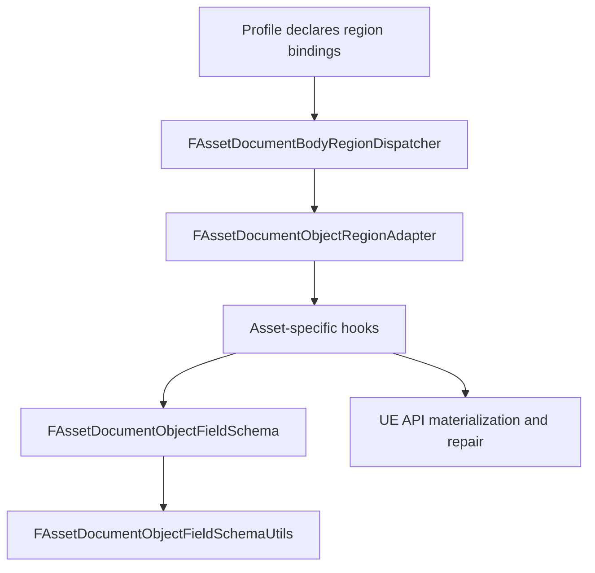

# AssetDocument Object Field Schema 与 Dispatcher Migration 设计

日期：2026-06-30

状态：正式 spec。进入实现前必须基于本文编写 `docs/superpowers/plans/` 下的 implementation plan。

关联文档：

- `docs/superpowers/specs/2026-06-24-asset-document-public-region-runtime-design.md`
- `docs/superpowers/specs/2026-06-30-asset-document-public-region-runtime-refactor-chain.md`
- `docs/superpowers/guides/asset-document-new-asset-class-extension-guide.md`

## 1. 背景

Public region runtime 已经落地，`FAssetDocumentObjectRegionAdapter` 可以把 object-shaped body region 接入 validate/apply/extract/diff 生命周期。但当前 object region 内部仍然大量依赖 profile 自己写字段校验：

- known field whitelist
- required/optional field
- JSON value type require
- unknown field diagnostic
- nested JSON Pointer path
- field-level diff helper
- profile 内部重复的 object shape guard

同时 `FAssetDocumentBodyRegionDispatcher` 已经能统一 Body object validation、region binding、policy、adapter dispatch，但多个 profile 仍保留手写 Body 生命周期。下一步应先补上 object field schema 这层，再以小范围 profile 切片验证 dispatcher migration，而不是直接进入 timeline/track region。

## 2. 问题陈述

现有公共层缺少 object field 层的 schema utility，导致 `FAssetDocumentObjectRegionAdapter` 只能统一 region 外壳，无法统一 object region 内部最常见的字段校验。

这带来三个后果：

- 新增 object region 时，profile 仍会复制字段白名单和类型检查。
- 同一类 unknown field 或 type mismatch diagnostic 在不同 profile 中实现方式不同。
- dispatcher 虽然存在，但 profile 迁移收益被 object hook 内部的大量样板代码抵消。

本 spec 的目标是补齐 object field schema，并用一个保守的 dispatcher migration pilot 证明它和现有 runtime 的组合方式。

## 3. 目标

本 spec 要实现的目标：

- 新增公共 object field schema utility，用组合方式描述 object region 字段。
- 统一 object field schema 的声明和校验入口，所有迁移区域都通过 `FAssetDocumentObjectFieldSchemaUtils` 进行字段校验。
- 迁移 AnimSequence `Preview`、`Playback` 两个已进入 public runtime 的 object region。
- 迁移 WidgetBlueprint `Palette`、`EditorOptions` 的字段校验到同一套 schema utility，但不强制在本 spec 中迁移整个 WidgetBlueprint Body dispatcher。
- 为后续 `References`、`Additive`、`RootMotion`、`Compression`、`Blend`、`ClassDefaults` 等 object region 建立可复用模式。
- 保持 MCP 输入输出 contract 不变。

## 4. 非目标

本 spec 不做：

- 不新增继承式 `FAssetDocumentBodyCapabilityBase`。
- 不把 capability 具体逻辑放入 dispatcher。
- 不迁移 graph/tree/timeline/fragment region。
- 不迁移 `ClassDefaults`，因为它需要 reflection property filtering 和语义化 default comparison。
- 不生成或修改 MCP schema。
- 不改变 sidecar sparse/delta policy。
- 不改变 asset class registry。
- 不改变现有 JSON 字段名、Body key、diff entry 格式。

## 5. 推荐架构



职责边界：

- `FAssetDocumentBodyRegionDispatcher` 负责 Body key 和 region dispatch。
- `FAssetDocumentObjectRegionAdapter` 只负责 object region 生命周期和 object shape guard。
- `FAssetDocumentObjectFieldSchema` 负责字段声明。
- `FAssetDocumentObjectFieldSchemaUtils` 负责字段校验、path、diagnostic helper。
- Asset-specific hooks 先调用 schema utility 完成字段校验，再把合法 JSON 应用到 UE 对象，或者从 UE 对象提取 JSON。

这个设计的重点是组合，但入口必须统一：object field schema 不挂在 adapter config 上，也不新增第二套 adapter-level schema path。所有迁移区域都声明 `FAssetDocumentObjectFieldSchema`，并通过 `FAssetDocumentObjectFieldSchemaUtils` 校验。`FAssetDocumentObjectRegionAdapter` 不理解字段 schema，也不持有字段 schema；它只把 object JSON 交给 hooks，hooks 用统一 utility 完成字段层校验和资产语义处理。

## 6. 公共类型

### 6.1 `FAssetDocumentObjectFieldSpec`

字段声明应覆盖第一版所需的最小信息：

```cpp
struct FAssetDocumentObjectFieldSpec
{
	FString Name;
	EJson Type;
	bool bRequired = false;
	FString MissingCode;
	FString TypeMismatchCode;
};
```

实现可以根据现有代码风格调整命名，但必须保持以下语义：

- `Name` 是 JSON object field name。
- `Type` 是期望的 JSON value type。
- `bRequired` 控制 missing field 是否报错。
- `MissingCode` 和 `TypeMismatchCode` 用于保持 profile 原有 diagnostic code。

第一版不引入默认值、enum schema、nested schema、array element schema。需要这些时必须另写 spec 或扩展 plan。

### 6.2 `FAssetDocumentObjectFieldSchema`

Schema 是多个 field spec 的组合，并描述 unknown field 行为：

```cpp
struct FAssetDocumentObjectFieldSchema
{
	TArray<FAssetDocumentObjectFieldSpec> Fields;
	bool bRejectUnknownFields = true;
	FString UnknownFieldCode;
};
```

约束：

- 默认拒绝 unknown fields。
- 同一 schema 内字段名不能重复。
- Schema 自身配置错误必须在测试或 adapter construction 阶段暴露，不应在 profile 运行时静默吞掉。

### 6.3 `FAssetDocumentObjectFieldSchemaUtils`

Utility 第一版提供以下能力：

- Validate object value is JSON object.
- Validate required fields.
- Validate known fields.
- Validate field JSON type.
- Build field JSON Pointer path.
- Emit `FAssetDocumentCapabilityResult` with existing diagnostic style.
- Return typed field value helpers for string/number/bool/object/array where existing code需要。

建议函数形态：

```cpp
class FAssetDocumentObjectFieldSchemaUtils
{
public:
	static FAssetDocumentCapabilityResult ValidateObjectFields(
		const FAssetDocumentRegionContext& Context,
		const TSharedRef<FJsonObject>& Object,
		const FAssetDocumentObjectFieldSchema& Schema);
};
```

可以增加小型 helper，但不得把 UE 对象读写、PropertySetter、ClassFinder 或 profile-specific default 逻辑放入 utility。

## 7. `FAssetDocumentObjectRegionAdapter` 边界

`FAssetDocumentObjectRegionAdapter` 不新增 optional schema config。

- `ValidateRegion` 仍负责要求 desired value 是 JSON object，然后调用 `Hooks.ValidateObject`。
- `Hooks.ValidateObject` 必须先调用 `FAssetDocumentObjectFieldSchemaUtils::ValidateObjectFields`，再执行资产语义校验。
- `ApplyRegion` 仍负责要求 desired value 是 JSON object，然后调用 `Hooks.ApplyObject`。
- `Hooks.ApplyObject` 对外部输入路径必须复用同一个 schema utility，不能复制字段校验。
- `DiffRegion` 仍负责要求 desired value 是 JSON object，然后调用 `Hooks.DiffObject`。
- `Hooks.DiffObject` 在比较前必须复用同一个 schema utility。
- `ExtractRegion` 不强制 schema validation；如果需要校验 extracted JSON，只能作为 debug/test helper，不能改变 extract contract。

这样做的结果是：字段规则只有一个来源，adapter 生命周期也不被字段 schema 污染。新增 object region 时，profile 必须显式提供 schema 并在 hook 入口调用 utility；如果某 region 暂时不能 schema 化，implementation plan 必须说明原因和后续清理入口。

## 8. Dispatcher Migration Pilot

本 spec 的 dispatcher 迁移是 pilot，不是全 profile 替换。

必须覆盖：

- AnimSequence `Preview`
- AnimSequence `Playback`

原因：

- 这两个 region 已经处在 public region runtime 路径上。
- 它们是 object-shaped region，适合验证 schema + object adapter + dispatcher 的组合。
- 它们不需要 graph/tree/timeline materializer。

WidgetBlueprint 本轮只迁移字段校验：

- `Palette`
- `EditorOptions`

原因：

- WidgetBlueprint 仍包含 graph/tree/bindings/animations 等复杂区域。
- 本轮不应把 WidgetBlueprint 整个 Body 生命周期强行改成 dispatcher。
- 先让它复用 object field schema utility，可以证明 utility 跨 profile 可用，同时保持改动风险可控。

## 9. 迁移区域定义

### 9.1 AnimSequence `Preview`

应通过 schema 描述当前 `Preview` object 允许字段和类型。Hook 仍负责：

- 将 preview mesh、animation mode 或其它字段应用到 `UAnimSequence` 相关预览设置。
- 从资产提取当前 preview object。
- 处理 UE API 失败、missing asset reference、load failure 等语义错误。

Schema 只负责 JSON 字段合法性。

### 9.2 AnimSequence `Playback`

应通过 schema 描述当前 `Playback` object 允许字段和类型。Hook 仍负责：

- 将播放相关设置应用到资产或 editor data。
- 提取当前播放设置。
- 保持现有 diff 行为。

Schema 不负责解释 frame rate、length、loop、rate 等字段之间的语义关系。跨字段语义仍在 hook 或 cross-region validation 中。

### 9.3 WidgetBlueprint `Palette`

应把 Palette object 的字段白名单和类型校验迁移到 `FAssetDocumentObjectFieldSchemaUtils`。

本轮不要求 Palette 进入 `FAssetDocumentBodyRegionDispatcher`。

### 9.4 WidgetBlueprint `EditorOptions`

应把 EditorOptions object 的字段白名单和类型校验迁移到 `FAssetDocumentObjectFieldSchemaUtils`。

本轮不要求 EditorOptions 进入 `FAssetDocumentBodyRegionDispatcher`。

## 10. Diagnostic 要求

必须保持以下行为稳定：

- Unknown field 必须指向具体 field path。
- Type mismatch 必须指向具体 field path。
- Missing required field 必须指向缺失字段 path 或当前 region path，implementation plan 需要按现有行为选定一种并固定测试。
- Diagnostic code 应优先沿用现有 profile code。
- 对外错误消息可以更统一，但不能丢失 region/body key 信息。

JSON Pointer path 必须复用 `FAssetDocumentJsonRegionUtils` 现有 escaping 逻辑，不能新增第二套 path escaping。

## 11. Diff 语义

本 spec 不重写 diff 语义。

要求：

- Desired object 在 diff 前必须经过 schema validation。
- Canonical JSON compare 仍使用现有 region runtime 或 profile helper。
- Diff entry 的 `path`、`desired`、`current`、`reason` 字段不因本 spec 改名。
- 如果某 region 当前没有 field-level diff，只做 whole-region diff，本 spec 不要求升级成 field-level diff。

## 12. 文件范围

允许新增：

- `Source/AssetDocument/Private/Regions/AssetDocumentObjectFieldSchemaUtils.h`
- `Source/AssetDocument/Private/Regions/AssetDocumentObjectFieldSchemaUtils.cpp`

允许修改：

- `Source/AssetDocument/Private/Profiles/AnimSequenceAssetDocumentCapability.cpp`
- `Source/AssetDocument/Private/Profiles/WidgetBlueprintAssetDocumentCapability.cpp`
- 相关 AssetDocument tests

需要 implementation plan 再确认是否修改：

- `Source/AssetDocument/Private/Regions/AssetDocumentObjectRegionAdapter.h`
- `Source/AssetDocument/Private/Regions/AssetDocumentObjectRegionAdapter.cpp`
- `Source/AssetDocument/Private/AssetDocumentBodyRegionDispatcher.*`
- `Source/AssetDocument/Public/AssetDocumentPolicy.h`
- `Source/AssetDocument/Public/AssetDocumentProfile.h`

默认不修改：

- MCP TypeScript 工具
- sidecar storage
- graph/tree materializer
- AnimMontage capability
- UBlueprint capability

## 13. 测试要求

必须新增或更新 unit/automation tests 覆盖：

- object schema accepts valid object。
- object schema rejects unknown field。
- object schema rejects wrong type。
- object schema rejects missing required field。
- JSON Pointer escaping works for field names needing escaping。
- AnimSequence `Preview` 行为迁移后 validate/apply/extract/diff 不回退。
- AnimSequence `Playback` 行为迁移后 validate/apply/extract/diff 不回退。
- WidgetBlueprint `Palette` 或 `EditorOptions` 至少一个 unknown field/type mismatch 测试使用公共 utility 路径。

必须运行：

- UBT Development build。
- AssetDocument 相关 automation tests。
- 若修改 MCP contract 相关文件则运行 MCP tests；本 spec 默认不应触发该项。

如果临时 host project 是必要条件，implementation plan 必须明确 host 路径和 junction 指向。

## 14. Implementation Plan 切分建议

建议按以下 task 切：

1. 新增 `FAssetDocumentObjectFieldSchemaUtils` 和纯 utility tests。
2. 为 AnimSequence `Preview` 声明 `FAssetDocumentObjectFieldSchema`，并在现有 object hooks 入口调用 schema utility。
3. 迁移 AnimSequence `Playback`，确保 dispatcher/runtime 路径复用同一套 schema utility，并补足 regression tests。
4. 迁移 WidgetBlueprint `Palette`、`EditorOptions` 的字段校验到 schema utility。
5. 回扫文档和 guide，如有必要补充“新增 object region 必须先写 schema”的规则。

每个 task 完成后应 checkpoint commit。Review diff range 必须使用对应 task 的 `TASK_BASE..HEAD`。

## 15. 验收标准

本 spec 完成后必须满足：

- `FAssetDocumentObjectFieldSchemaUtils` 存在，并被至少两个 profile 使用。
- AnimSequence `Preview`、`Playback` 通过 object schema utility + object adapter + dispatcher 路径完成字段校验。
- WidgetBlueprint `Palette`、`EditorOptions` 至少字段校验复用同一套 schema utility。
- `FAssetDocumentObjectRegionAdapter` 不新增 optional schema config。
- 没有新增继承式 capability base。
- 没有新增 asset class switch。
- 没有改变 MCP contract。
- 现有 AssetDocument automation tests 通过，新增 tests 覆盖 object field schema 的 failure path。

## 16. 用户审阅重点

请重点审阅以下决定：

- 第一版 object field schema 只做最小字段类型校验，不做 nested schema 和 enum schema。
- WidgetBlueprint 本轮只迁移字段校验，不迁移整个 Body dispatcher。
- AnimSequence `Preview`、`Playback` 作为 dispatcher + object schema 的第一组 pilot。
- `ClassDefaults`、graph/tree/timeline/fragment 都明确排除在本 spec 外。

这些边界是为了让第一轮公共层抽取能被验证，而不是再次变成一个横跨所有 profile 的大改动。
