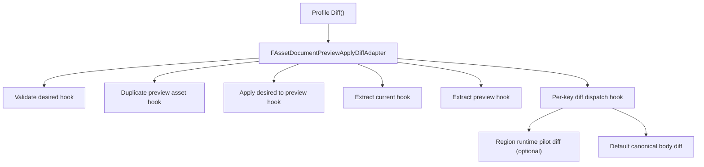

# AssetDocument Preview Apply Diff Adapter 设计

日期：2026-06-30

状态：正式 spec 草案。用户审核通过后，才能进入 `docs/superpowers/plans/` implementation plan 阶段。

关联文档：

- `docs/superpowers/specs/2026-06-30-asset-document-public-region-runtime-refactor-chain.md`
- `docs/superpowers/specs/2026-06-30-asset-document-object-field-schema-dispatcher-migration-design.md`
- `docs/superpowers/specs/2026-06-24-asset-document-public-region-runtime-design.md`

## 1. 重构链位置

本 spec 对应重构链第 3 环：`Preview Apply Diff Adapter`。

第 2 环 `Object Field Schema Utilities` 已经完成第一版：

- `FAssetDocumentObjectFieldSchemaUtils` 已存在。
- AnimSequence `Preview` / `Playback` 已通过 schema utility 校验字段。
- WidgetBlueprint `Palette` / `EditorOptions` 已复用同一套 utility。
- `FAssetDocumentObjectRegionAdapter` 没有持有 schema config。

下一步不应继续横向扩更多 object field，例如 `References` / `RootMotion` / `Compression`。那些是第 2 环模式的后续推广，但不是重构链的下一环。链上下一环应处理 AnimSequence 和 AnimMontage 中重复度更高的 diff 预览流程。

## 2. 背景

AnimSequence 和 AnimMontage 现在都有相似的 Body diff scaffold：

1. 要求 desired Body 是 JSON object。
2. 去掉 extract-only `_Skipped` metadata。
3. validate desired Body。
4. duplicate 当前 UE asset 到 transient preview asset。
5. 构造 dry-run preview context。
6. 对 preview asset apply desired Body。
7. extract 当前 asset Body。
8. extract preview asset Body。
9. 去掉 current/preview extract 中的 `_Skipped`。
10. 遍历 desired Body 中出现的 key。
11. 用 canonical JSON compare 判断 `changed` / `unchanged`。
12. 生成 body-level diff entry。

这些步骤是公共生命周期和 JSON diff scaffold，不属于某个 asset 的业务语义。当前它们分别散落在 `FAnimSequenceAssetDocumentCapability::Diff` 和 `FAnimMontageAssetDocumentCapability::Diff`，并且 `JsonValueToComparableString`、`AddBodyDiffEntry`、`MakeBodyObjectForDiff` 等 helper 也存在重复。

## 3. 问题陈述

继续让每个 animation profile 手写 preview diff 有三个问题：

- 新 profile 或新 region 很容易复制整段 duplicate/apply/extract/diff 流程。
- Body diff entry shape 和 canonical comparison 容易在不同 profile 间产生漂移。
- 已接入 region runtime 的 region 与仍走 profile-level diff 的 region 混在同一个大函数里，使 capability 继续增长。

需要一个公共层把“preview apply diff”流程抽出来，但不能让公共层理解 `UAnimSequence`、`UAnimMontage`、notify、section、curve 等业务语义。

## 4. 目标

本 spec 要实现：

- 新增公共 preview apply diff scaffold，用组合式 hooks 注入 asset-specific 行为。
- 把 canonical JSON compare、body diff entry 生成、`_Skipped` stripping 等重复 helper 收到公共 utility 或 adapter 内。
- 先迁移 AnimMontage `Diff` 到公共 scaffold，因为它的 diff 主流程更直接，没有 region pilot 分支。
- 再迁移 AnimSequence `Diff` 的公共部分，同时保留它对 `Preview` / `Playback` / `NotifyTracks` 的 region runtime pilot diff 分派。
- 保持 diff entry JSON shape 不变：`path`、`status`、`current`、`desired`。
- 保持现有 validation、apply、extract、asset duplicate failure diagnostic 不变，除非 implementation plan 明确列出兼容变更并加测试。

## 5. 非目标

本 spec 不做：

- 不迁移 graph/tree diff。
- 不迁移 timeline placement adapter。
- 不迁移 fragment array adapter。
- 不改变 object field schema。
- 不把 `UAnimSequence` / `UAnimMontage` 逻辑写进公共 adapter。
- 不改变 MCP diff contract。
- 不改变 sidecar sparse/delta policy。
- 不改变 Body key 名称或 diff entry path。
- 不要求第一版把所有 per-region diff 都变成 field-level diff。

## 6. 推荐架构



公共层负责：

- desired Body object guard。
- diff body normalization，例如移除 `_Skipped`。
- duplicate/apply/extract 调用顺序。
- preview context 的 dry-run 标记由 hook 或 adapter options 控制。
- current/preview Body normalization。
- 遍历 desired keys。
- 默认 canonical JSON compare。
- 默认 diff entry 生成。

profile hook 负责：

- validate desired Body。
- duplicate 具体 UE asset。
- 构造 preview `FAssetDocumentCapabilityContext`。
- apply desired Body 到 preview asset。
- extract current/preview Body。
- 对某些 key 使用 region runtime pilot diff，例如 AnimSequence `Preview`、`Playback`、`NotifyTracks`。
- cleanup transient preview asset，如后续发现必须显式清理。

## 7. 公共类型建议

第一版建议新增两个文件：

- `Source/AssetDocument/Private/Regions/AssetDocumentPreviewApplyDiffAdapter.h`
- `Source/AssetDocument/Private/Regions/AssetDocumentPreviewApplyDiffAdapter.cpp`

候选类型：

```cpp
struct FAssetDocumentPreviewApplyDiffHooks
{
	TFunction<FAssetDocumentCapabilityResult(
		const FAssetDocumentCapabilityContext&,
		const TSharedRef<FJsonObject>&)> ValidateDesiredBody;

	TFunction<FAssetDocumentCapabilityResult(
		const FAssetDocumentCapabilityContext&,
		UObject*&)> DuplicatePreviewAsset;

	TFunction<FAssetDocumentCapabilityContext(
		const FAssetDocumentCapabilityContext&,
		UObject*)> MakePreviewContext;

	TFunction<FAssetDocumentCapabilityResult(
		const FAssetDocumentCapabilityContext&,
		const TSharedRef<FJsonValue>&)> ApplyDesiredBody;

	TFunction<FAssetDocumentCapabilityResult(
		const FAssetDocumentCapabilityContext&,
		TSharedRef<FJsonObject>&)> ExtractBody;

	TFunction<FAssetDocumentCapabilityResult(
		const FAssetDocumentCapabilityContext&,
		const FString&,
		TSharedPtr<FJsonValue>,
		TSharedPtr<FJsonValue>,
		TArray<TSharedPtr<FJsonValue>>&)> DiffBodyKey;
};
```

实现计划可以调整签名，但必须满足：

- hook 是组合，不是继承。
- adapter 不包含 asset class switch。
- `DiffBodyKey` 是可选 hook；没有 hook 或 hook 返回“未处理”时走默认 canonical diff。
- 公共层不直接调用 profile 的私有 parser 或 UE-specific API。

## 8. 公共 JSON diff utility

第一版应把以下重复 helper 收敛为公共能力：

- canonical JSON string compare。
- diff body copy while stripping `_Skipped`。
- add diff entry with `{ path, status, current, desired }`。
- default current/desired lookup where missing value becomes JSON null。

建议放在 preview diff adapter 同文件内，除非 implementation plan 发现已有 utility 更适合承载。若放入 `FAssetDocumentJsonRegionUtils`，必须保持它仍是纯 JSON helper，不能引入 preview asset 概念。

## 9. 迁移顺序

### 9.1 第一刀：AnimMontage

先迁移 AnimMontage，因为它的 current diff 主流程基本是纯 body-level default diff：

- validate desired Body。
- duplicate `UAnimMontage`。
- dry-run apply。
- extract current/preview Body。
- canonical compare each desired key。

迁移后 `FAnimMontageAssetDocumentCapability::Diff` 应主要负责配置 hooks 并调用公共 adapter。

### 9.2 第二刀：AnimSequence

AnimSequence 的主流程相同，但目前对以下 key 有 pilot 分支：

- `Preview`
- `Playback`
- `NotifyTracks`

迁移时必须保留这些 region runtime diff 分派。也就是说公共 adapter 要允许 profile 对单个 desired body key 接管 diff entry 生成。

## 10. Diagnostic 与行为要求

必须保持：

- 非 object Body 仍返回 `/Body` + `InvalidBodyType`。
- 不支持 asset type 仍返回 `/Body` + `UnsupportedAsset`。
- duplicate 失败仍返回 `/Body` + `DuplicateFailed`，消息可保持 profile 现有文案。
- apply preview 失败时原样返回 apply diagnostic。
- extract current/preview 失败时原样返回 extract diagnostic。
- `_Skipped` 不参与 diff。
- desired 中没有出现的 Body key 不产生 diff entry。
- missing current/preview value 使用 JSON null。
- default diff entry path 仍是 `/Body/<Key>`。
- default status 仍是 `unchanged` 或 `changed`。

## 11. 测试要求

必须新增公共 runtime tests 覆盖：

- adapter rejects non-object desired Body。
- adapter strips `_Skipped` before diff traversal。
- adapter duplicates, applies, extracts in expected order。
- adapter emits default canonical diff entry with stable shape。
- adapter treats object key order as canonical equal。
- adapter lets profile hook override a specific body key diff.
- adapter propagates validate/apply/extract/duplicate failures without converting diagnostic codes.

必须保留或补充 profile tests：

- AnimMontage diff unchanged/changed 行为不回退。
- AnimMontage `_Skipped` 不参与 diff。
- AnimSequence `Preview` / `Playback` diff 仍经过 region runtime pilot path。
- AnimSequence `NotifyTracks` diff 仍经过 named array pilot path。
- full `AssetFactory.AssetDocument` automation 通过。

## 12. 文件范围

允许新增：

- `Source/AssetDocument/Private/Regions/AssetDocumentPreviewApplyDiffAdapter.h`
- `Source/AssetDocument/Private/Regions/AssetDocumentPreviewApplyDiffAdapter.cpp`

允许修改：

- `Source/AssetDocument/Private/Profiles/AnimMontageAssetDocumentCapability.cpp`
- `Source/AssetDocument/Private/Profiles/AnimSequenceAssetDocumentCapability.cpp`
- `Source/AssetDocument/Private/Tests/AssetDocumentRegionRuntimeTests.cpp`
- `Source/AssetDocument/Private/Tests/AssetDocumentAnimMontageTests.cpp`
- `Source/AssetDocument/Private/Tests/AssetDocumentAnimSequenceTests.cpp`

默认不修改：

- `FAssetDocumentBodyRegionDispatcher`
- `FAssetDocumentObjectRegionAdapter`
- `FAssetDocumentNamedArrayRegionAdapter`
- object field schema utility
- MCP TypeScript files
- graph/tree materializers
- fragment compiler

## 13. 实现切分建议

implementation plan 应按以下 task 切：

1. 新增 preview apply diff adapter 和纯 runtime tests。
2. 迁移 AnimMontage `Diff` 到公共 adapter，保持 profile behavior。
3. 迁移 AnimSequence `Diff` 的公共流程到公共 adapter，保留 per-key pilot diff hook。
4. 回扫重复 helper，删除 profile 内已被公共 adapter 替代的 `JsonValueToComparableString`、`AddBodyDiffEntry`、`MakeBodyObjectForDiff`，但只删除被当前迁移完全覆盖的版本。

每个 task 必须 checkpoint commit，并分别做 spec review 和 code quality review。

## 14. 停止条件

出现以下情况必须停止并回到 spec：

- 公共 adapter 需要 `if UAnimSequence / if UAnimMontage`。
- 公共 adapter 开始理解 notify、section、curve、fragment、graph 等业务语义。
- 为了共用流程而改变 diff entry contract。
- 为了共用流程而跳过 profile 原本的 validate/apply/extract。
- AnimSequence 的 region runtime pilot diff 被绕开或删除。
- 单个 task 同时迁移 preview diff、identity array、timeline placement。

## 15. 验收标准

本 spec 完成后必须满足：

- `FAssetDocumentPreviewApplyDiffAdapter` 或等价公共组合式 scaffold 存在。
- AnimMontage 和 AnimSequence 至少各有一条 diff 主流程复用该公共 scaffold。
- 公共层不包含 asset-specific class switch。
- AnimSequence 的 `Preview`、`Playback`、`NotifyTracks` pilot diff 行为仍可测试地保留。
- Diff entry shape 与现有 MCP/AssetDocument consumer 兼容。
- UBT 和 AssetDocument automation 通过。

## 16. 用户审阅重点

请重点审阅：

- 第 3 环是否先抽 profile-level preview apply diff，而不是继续横向扩 object field schema。
- 第一版是否接受“公共 adapter + per-key override hook”的组合形式，以保留 AnimSequence 已有 region runtime pilot。
- canonical JSON helper 是放在 preview diff adapter 内，还是升级进 `FAssetDocumentJsonRegionUtils`。
- 第一刀是否先做 AnimMontage，再做 AnimSequence。
