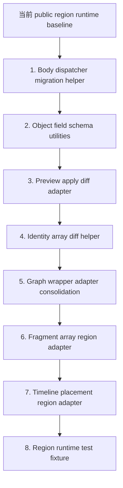

# AssetDocument Public Region Runtime 重构链

日期：2026-06-30

状态：正式重构链文档。后续每一环进入实现前仍必须单独写 implementation plan，并按 task checkpoint commit 推进。

## 1. 背景

`2026-06-24-asset-document-public-region-runtime-design.md` 已经把 AssetDocument 的方向从每个资产堆一整套 extractor / applier / reducer / diff helper，推进到 `sidecar + profile + policy + public capability/region runtime + thin asset-specific hook`。

当前已经存在的公共层包括：

- `FAssetDocumentBodyRegionDispatcher`
- `IAssetDocumentRegionAdapter`
- `FAssetDocumentRegionRuntime`
- `FAssetDocumentJsonRegionUtils`
- `FAssetDocumentDeferredRegionAdapter`
- `FAssetDocumentObjectRegionAdapter`
- `FAssetDocumentNamedArrayRegionAdapter`
- WidgetBlueprint graph/tree/binding/animation wrapper adapters

这说明方向已经成立，但还没有完成第二阶段的瘦身：多个 profile 里仍保留大量重复生命周期代码，例如 Body key 校验、object field 白名单、preview apply diff、identity array diff、fragment array orchestration、timeline placement validation。这个文档负责把后续抽公共层的顺序固定下来，避免下一轮新增资产时继续回到 asset-specific 巨型 capability。

## 2. 设计哲学

本重构链遵循以下原则：

- 优先组合，不引入需要 profile 继承的 `CapabilityBase`。
- 公共层只承接生命周期、JSON shape、diagnostic、dispatch、diff scaffold、canonical compare、identity comparison 等可复用机制。
- UE API materialization、compile/rebuild/cache repair、graph semantic identity、component alias、ClassDefaults property filtering 等资产语义留在 asset-specific hook。
- 不做按资产类型或字段名硬编码的全局 `switch`。
- 不做一个万能 adapter。公共层按 region shape 拆分，profile 通过 bindings、policies、schema、hooks 组合使用。
- 每一环必须先迁移小而真实的 profile 切片，验证行为一致，再推广。
- 如果一个抽象需要理解某个资产的完整领域语义，它不属于 public region runtime。

## 3. 当前问题分层

当前剩余重复不是一种问题，而是几类可拆的重复：

- Body 层重复：Body 必须是 object、known body keys、required body keys、apply order、region dispatch、cross-region validation。
- Object region 重复：字段白名单、字段类型校验、optional/required field、unknown field diagnostic、JSON Pointer path。
- Diff scaffold 重复：validate desired、duplicate transient asset、apply preview、extract current/preview、canonical compare、生成 diff entry。
- Identity array 重复：按 semantic key 对齐数组元素、检测 added/removed/changed、构造稳定 path。
- Graph/tree wrapper 重复：把现有 graph/tree materializer 接到 region runtime 的生命周期和诊断模型。
- Fragment array 重复：fragment object 数组 validate/apply/extract/diff 生命周期。
- Timeline placement 重复：time/duration/name/track identity、track existence、duplicate placement key、post-apply repair。
- Test fixture 重复：runtime adapter tests、apply-file/extract/diff scaffold、diagnostic assertion。

这些问题必须按形态拆，而不是按资产拆。

## 4. 总体重构链

排序原则：

- 先抽最靠近现有 runtime 且风险最低的重复：Body dispatch 和 object field。
- 再抽不会改变资产 materialization 的 diff scaffold 和 identity diff。
- Graph/tree 只统一 wrapper 生命周期，不提前动 graph materializer。
- Fragment 和 timeline 最后做，因为它们更容易碰到 UE 对象生命周期、track cache、section linking、marker rebuild 等资产语义。
- Test fixture 可以在任意一环补，但不应先写成大框架；以真实 adapter 测试反推公共 fixture。

## 5. 第 1 环：Body Dispatcher Migration Helper

优先级：P0

目标：

- 让 profile 不再手写 Body object require、known key rejection、required key validation、apply order、region dispatch。
- 让新增 profile 默认声明 `RegionBindings + RegionPolicies + Adapters + Hooks`，而不是复制 `ValidateBody` / `PreflightBody` / `ApplyBody` / `ExtractBody` / `DiffBody` 的大段流程。
- 保持 cross-region validation 和 post-apply repair 为 hook，不放进 dispatcher。

候选公共接口：

- `FAssetDocumentBodyRegionDispatcher`
- `FAssetDocumentRegionBinding`
- `FAssetDocumentRegionPolicy`
- 一个轻量 builder/helper，例如 `FAssetDocumentBodyRegionDispatcherBuilder` 或 profile-private factory function。是否新增类由 implementation plan 决定，但不得通过继承能力基类实现。

候选迁移区域：

- AnimSequence 已接入 dispatcher 的 `Preview`、`Playback`、`NotifyTracks`。
- UBlueprint 和 WidgetBlueprint 的 deferred/object/named-array 小 region。
- AnimMontage 后续可接入与 AnimSequence 同形态的 object/array/timeline region。

明确不做：

- 不把所有 capability 逻辑塞进 dispatcher。
- 不让 dispatcher 理解 `UAnimSequence`、`UBlueprint`、`UWidgetBlueprint`。
- 不迁移 graph/tree materializer。
- 不用 dispatcher 处理 profile metadata、sidecar IO、asset class registry。

完成标准：

- 至少一个仍有手写 Body 生命周期的 profile 被迁移到 dispatcher。
- 已迁移 profile 的 unknown body key、missing required key、apply order、diff path 行为保持原样或有明确记录的兼容变更。
- 迁移后 asset-specific capability 只保留 region hooks、cross-region validation、post-apply repair 和 profile 注册。

## 6. 第 2 环：Object Field Schema Utilities

优先级：P0

目标：

- 把 object region 内部的字段白名单、字段类型、required/optional、unknown field diagnostic、JSON Pointer path 统一到公共 utility。
- 让所有 object region 通过统一的 `FAssetDocumentObjectFieldSchema` 和 `FAssetDocumentObjectFieldSchemaUtils` 做字段检查，而不是每个 profile 重复写字段检查。
- 为后续 `References`、`Preview`、`Playback`、`Additive`、`RootMotion`、`Compression`、`Blend`、`Palette`、`EditorOptions`、`ClassDefaults` 等 object region 提供统一入口。

候选公共接口：

- `FAssetDocumentObjectFieldSpec`
- `FAssetDocumentObjectFieldSchema`
- `FAssetDocumentObjectFieldSchemaUtils`
- `FAssetDocumentObjectFieldSchemaUtils` 作为唯一字段校验入口。第一版优先保持组合式，不引入继承，也不把字段 schema 挂到 `FAssetDocumentObjectRegionAdapter` config 上。

候选迁移区域：

- AnimSequence `Preview`
- AnimSequence `Playback`
- WidgetBlueprint `Palette`
- WidgetBlueprint `EditorOptions`

明确不做：

- 不在第一版迁移 `ClassDefaults`，因为它需要 property filtering 和 reflection 语义。
- 不把 object field schema 变成 MCP contract schema generator。
- 不把 UE property setter 或 class finder 放进 schema utility。

完成标准：

- Object field validation 的错误 path、错误 code、unknown field 行为有测试覆盖。
- 至少两个不同 profile 的 object region 使用同一套 utility。
- `FAssetDocumentObjectRegionAdapter` 仍然只负责 region 生命周期，资产语义通过 hook 注入。

## 7. 第 3 环：Preview Apply Diff Adapter

优先级：P0

目标：

- 统一这类 diff 流程：validate desired、复制 transient preview asset、apply desired、extract current/preview、canonical JSON compare、生成 diff entry、清理 preview asset。
- 降低 AnimSequence 和 AnimMontage 中重复 diff scaffold 的体积。

候选公共接口：

- `FAssetDocumentPreviewApplyDiffRegionAdapter`
- `FAssetDocumentPreviewApplyDiffHooks`

候选迁移区域：

- AnimSequence object/named-array/timeline 中当前使用 preview apply diff 的 region。
- AnimMontage 中同形态 region。

明确不做：

- 不替代 graph/tree diff。
- 不在 adapter 内决定 duplicate 策略、apply 细节、extract 细节。
- 不改变 canonicalizer 语义。

完成标准：

- 公共 adapter 只依赖 hooks 完成 duplicate/apply/extract/cleanup。
- Diff entry path 和 reducer 语义与现有测试兼容。
- 至少 AnimSequence 和 AnimMontage 各迁移一个 region。

## 8. 第 4 环：Identity Array Diff Helper

优先级：P0

目标：

- 统一 named array 或 identity array 的 semantic diff scaffold。
- 让 profile 只声明元素 identity、元素 validate/apply/extract、元素 path label。

候选公共接口：

- `FAssetDocumentIdentityArrayDiffHelper`
- `FAssetDocumentIdentityArrayElementSpec`

候选迁移区域：

- UBlueprint `Variables`
- UBlueprint `ImplementedInterfaces`
- UBlueprint `Components`
- WidgetBlueprint `Variables`
- AnimSequence `NotifyTracks`
- AnimSequence curves 或 metadata 中符合 identity array 的部分

明确不做：

- 不把 component alias、owner class identity、graph node semantic id 写死进 helper。
- 不处理 timeline placement 的 time/duration/track 语义；timeline 另有一环。

完成标准：

- added/removed/changed diff entries 稳定且 path 可预测。
- identity 冲突 diagnostic 有覆盖。
- 至少一个 Blueprint profile 和一个 animation profile 使用同一 helper。

## 9. 第 5 环：Graph Wrapper Adapter Consolidation

优先级：P1

目标：

- 统一 UBlueprint 和 WidgetBlueprint graph wrapper 的 validate/apply/extract/diff 生命周期接线。
- 保留 graph materializer、node semantic id、pin mapping、compile/repair 为资产或 graph-specific hook。

候选公共接口：

- `FAssetDocumentGraphRegionWrapperAdapter`
- 或现有 WidgetBlueprint wrapper adapter 的更通用版本。

候选迁移区域：

- UBlueprint `UbergraphPages`
- UBlueprint `FunctionGraphs`
- UBlueprint `MacroGraphs`
- WidgetBlueprint synthetic graph body

明确不做：

- 不重写 graph DSL。
- 不改变 graph node/pin identity 策略。
- 不把 Widget tree 和 Blueprint graph 合成一个 adapter。

完成标准：

- UBlueprint 与 WidgetBlueprint 共享 wrapper lifecycle。
- Graph materialization 仍可单独测试和替换。
- Graph diagnostic bridge 统一输出 region path。

实现状态（2026-06-30）：

- 已新增 `FAssetDocumentGraphRegionWrapperAdapter` 作为 synthetic graph body lifecycle wrapper。
- WidgetBlueprint graph region adapter 已委托公共 wrapper，graph materializer 仍为 `FWidgetBlueprintGraphAdapter`。
- UBlueprint graph validate / apply / extract / diff 已通过公共 wrapper 接线，staged parent / variable validation 保持 UBlueprint hook。
- UBlueprint `FunctionGraphs` / `MacroGraphs` 仍未新增 authoring 支持。
- UBlueprint graph extract 合并 `_Skipped` evidence 时保持 existing evidence，不覆盖其它 Body region 的 skipped 记录。

## 10. 第 6 环：Fragment Array Region Adapter

优先级：P1

目标：

- 统一 fragment object array 的 validate/apply/extract/diff 生命周期。
- 把 fragment compiler、fragment materialization、UE object ownership 留给 hooks。

候选公共接口：

- `FAssetDocumentFragmentArrayRegionAdapter`
- `FAssetDocumentFragmentArrayHooks`

候选迁移区域：

- AnimSequence `Metadata`
- AnimSequence `AssetUserData`
- AnimMontage `Metadata`
- AnimMontage `SectionMetadata`
- notify / notify-state object fragments 中符合 fragment array 的部分

实现状态（2026-07-01）：

- 已新增 `FAssetDocumentFragmentArrayRegionAdapter` / `FAssetDocumentFragmentArrayHooks`，公共实现位于 `Source/AssetDocument/Private/Regions/AssetDocumentFragmentArrayRegionAdapter.*`。
- AnimSequence `Metadata` 已迁移到公共 fragment array adapter；fragment compiler、object materialization、managed-object rename/writeback、`RemoveMetaData` / `AddMetaData` 仍保留在 AnimSequence profile hook 中。
- AnimSequence `AssetUserData` 已迁移到公共 fragment array adapter；`UAssetUserData` materialization、managed-object outer move、反射写回 `UAnimationAsset.AssetUserData` 仍保留在 AnimSequence profile hook 中。
- AnimMontage `Metadata` 已迁移到公共 fragment array adapter；staging outer、`UAnimMetaData` compile/materialization、move-to-montage outer、writeback 到 Montage `MetaData` 数组仍保留在 AnimMontage profile hook 中。
- AnimMontage `AssetUserData` deferred：当前 AnimMontage profile/capability/schema/test 没有 `Body.AssetUserData` authoring surface，本环不新增资产表面。已核对 `Source/AssetDocument/Private/Profiles/AnimMontageAssetDocumentProfile.cpp`、`Source/AssetDocument/Private/Profiles/AnimMontageAssetDocumentCapability.cpp`、`Source/AssetDocument/Private/Tests/AssetDocumentAnimMontageTests.cpp`。
- AnimMontage `SectionMetadata` 保持 Montage capability 内的 `map<SectionName,array<EmbeddedObject|DefinitionRef>>` 形态；只在安全层级复用 `FAssetDocumentFragmentArrayUtils` 做 per-section fragment array entry path、parse/extract value 构造，不引入 `MapOfFragmentArraysAdapter`，也不迁移到 `FAssetDocumentFragmentArrayRegionAdapter`。`InvalidBodySectionType` 诊断由显式测试覆盖并保持稳定。

保留原因：

- AnimMontage `SectionMetadata` 的 section target validation 依赖 `CompositeSections`，apply 时还要维护 staging outer、`UAnimMetaData::StaticClass()` compile path 和 section writeback 语义；这些仍是 Montage-specific hook，而不是公共 fragment array adapter 的职责。

明确不做：

- 不把 fragment compiler 合并进 adapter。
- 不处理 timeline placement key。
- 不让 adapter 创建具体 UObject 类型。

完成标准：

- Fragment array 的 empty/delete/replace 行为统一。
- Fragment diagnostic path 统一。
- Fragment 编译和对象实例化仍在 profile hook 中。

## 11. 第 7 环：Timeline Placement Region Adapter

优先级：P1

目标：

- 统一 timeline 上的 placement array：time、duration、name、track identity、duplicate placement key、track existence validation。
- 把 marker cache repair、section linking、track rebuild、notify object materialization 留给 profile hook。

候选公共接口：

- `FAssetDocumentTimelinePlacementRegionAdapter`
- `FAssetDocumentTimelinePlacementSpec`
- `FAssetDocumentTimelineTrackResolver`

候选迁移区域：

- AnimSequence `Notifies`
- AnimSequence `NotifyStates`
- AnimSequence `SyncMarkers`
- AnimMontage `CompositeSections`
- AnimMontage `SlotAnimTracks` 的外层 track/segment placement

明确不做：

- 不把 timeline adapter 作为第一环。
- 不在 adapter 内直接调用 AnimSequence 或 AnimMontage API。
- 不把 marker、notify、section 的所有字段统一成一种对象。

完成标准：

- 同一套 placement duplicate key 和 track validation 覆盖 AnimSequence 与 AnimMontage。
- Apply 后 repair hook 明确执行，测试覆盖 cache/section/track 相关结果。
- Diff path 对 time/name/track 稳定。

## 12. 第 8 环：Region Runtime Test Fixture

优先级：P2

目标：

- 降低新增 adapter 测试成本。
- 统一 validate/apply/extract/diff 的 fixture、context builder、diagnostic assertion、canonical JSON assertion。

候选公共接口：

- `FAssetDocumentRegionRuntimeTestFixture`
- `FAssetDocumentRegionRuntimeTestContextBuilder`

候选覆盖：

- deferred region tests
- object field schema tests
- named array tests
- dispatcher tests
- preview apply diff tests

明确不做：

- 不先写没有真实使用者的大测试框架。
- 不替代 profile-level automation tests。

完成标准：

- 新 adapter 测试不再重复 context/bootstrap 样板。
- Fixture 的默认行为不隐藏 diagnostic 和 path 断言。

## 13. 推荐执行顺序

第一批执行顺序：

1. `Object Field Schema Utilities + Dispatcher Migration Pilot`
2. `Preview Apply Diff Adapter`
3. `Identity Array Diff Helper`

第二批执行顺序：

1. `Graph Wrapper Adapter Consolidation`
2. `Fragment Array Region Adapter`
3. `Timeline Placement Region Adapter`

第三批执行顺序：

1. `Region Runtime Test Fixture`
2. 回扫 guide、AGENTS、deferred-fields 长期维护文档
3. 选择下一个新资产 profile，只允许 thin hook 接入，不再新增整套私有 lifecycle

## 14. 为什么不是先做 Timeline

Timeline/track region 确实需要抽，但不适合作为下一步第一环：

- 它会碰到 UE materialization、track cache、marker rebuild、section linking。
- 它容易把公共 adapter 写成 AnimSequence/AnimMontage 专用 adapter。
- 当前 `FAssetDocumentObjectRegionAdapter`、`FAssetDocumentNamedArrayRegionAdapter`、dispatcher 已经落地，先迁移 object field 和 dispatcher 的回报更直接。
- Object field 和 dispatcher 是后面 preview diff、fragment、timeline 的前置清理。

所以 timeline 应该在 object field、preview diff、identity diff 之后进入。

## 15. 每一环的 Implementation Plan 必备项

每个重构环进入实现前，implementation plan 必须包含：

- `SPEC_BASE` 和每个 task 的 `TASK_BASE`。
- 允许修改的文件范围。
- 不允许修改的 profile 或 region。
- 迁移前后的行为对照。
- 需要保留的 asset-specific hooks。
- 对应 automation/unit tests。
- UBT 验证方式。
- review diff range。
- checkpoint commit 策略。

如果 implementation plan 无法明确这些项，说明该环拆得还不够小。

## 16. 停止条件

出现以下任一情况时，必须停止当前抽象并回到 spec 讨论：

- 公共层开始出现按资产类名、字段名、UE 类型名分支的全局逻辑。
- 一个 adapter 需要理解两个以上无关 region shape。
- 为了抽象而要求 profile 继承公共基类。
- 新 utility 不能用 hooks 表达资产语义，只能读写具体 UObject。
- 迁移导致 diagnostic path、unknown key rejection、diff entry 格式无法解释地改变。
- 单个 implementation task 横跨 graph、timeline、fragment、object field 等多个 shape。

## 17. 成功标准

整条重构链完成后，AssetDocument 新资产接入应满足：

- profile 主要声明 `RegionBindings`、`RegionPolicies`、adapter config 和 hooks。
- Body 生命周期由 dispatcher 处理。
- object/named-array/fragment/timeline 等 region shape 复用公共 adapter 或 helper。
- asset-specific capability 不再成为跨 region 的巨型类。
- 新资产只在 UE materialization、semantic identity、post-apply repair、compile/rebuild 处写 thin hooks。
- 测试能分别覆盖 public region runtime、adapter utility、profile behavior。

这条链的目标不是一次性把所有历史代码改完，而是让每个后续资产和每次 profile 扩展都沿着同一个方向变薄。
